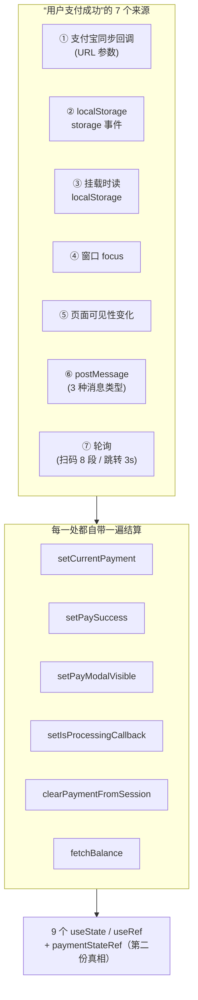
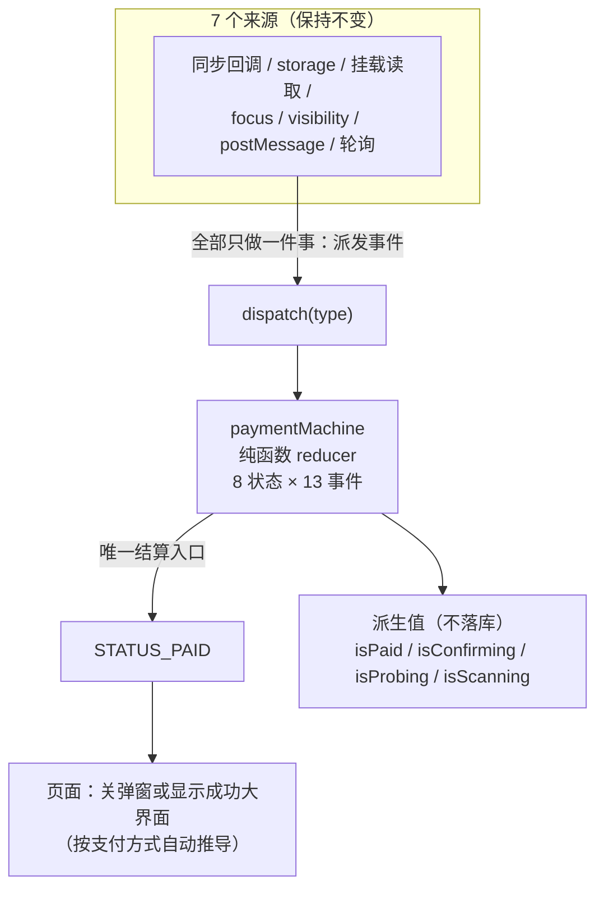
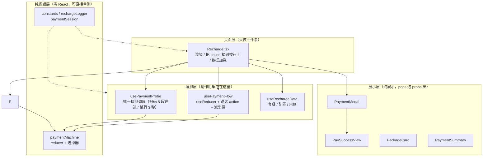
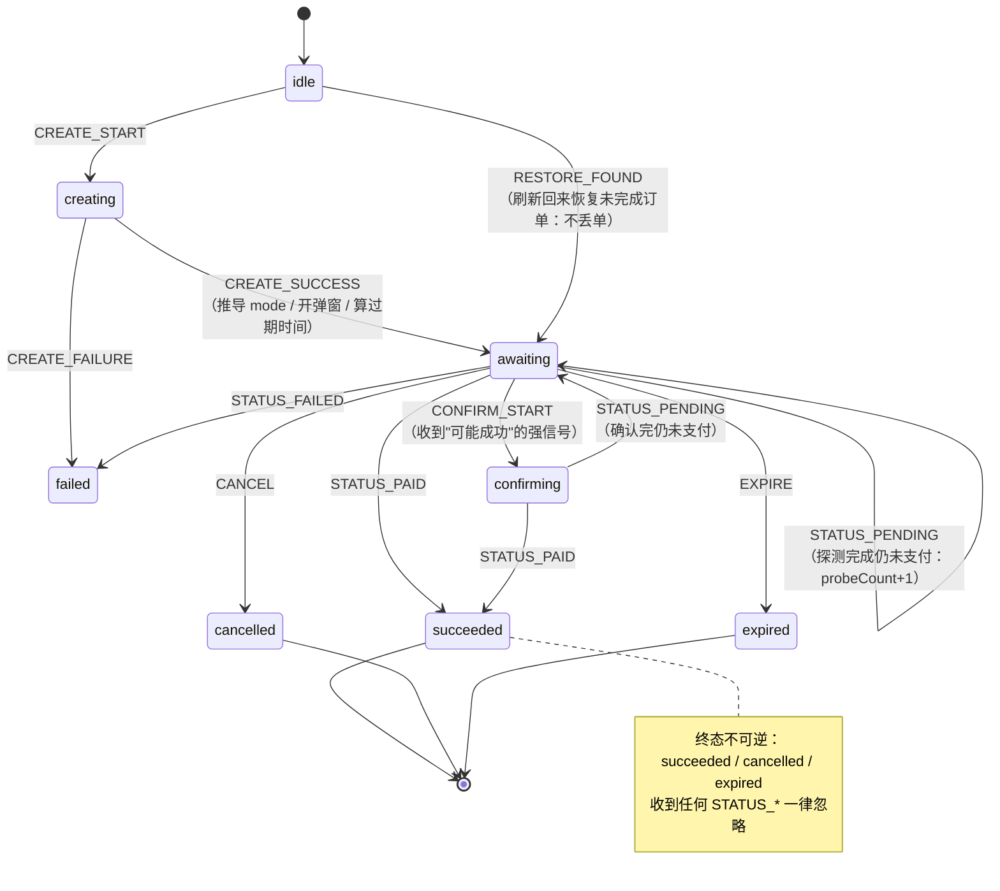
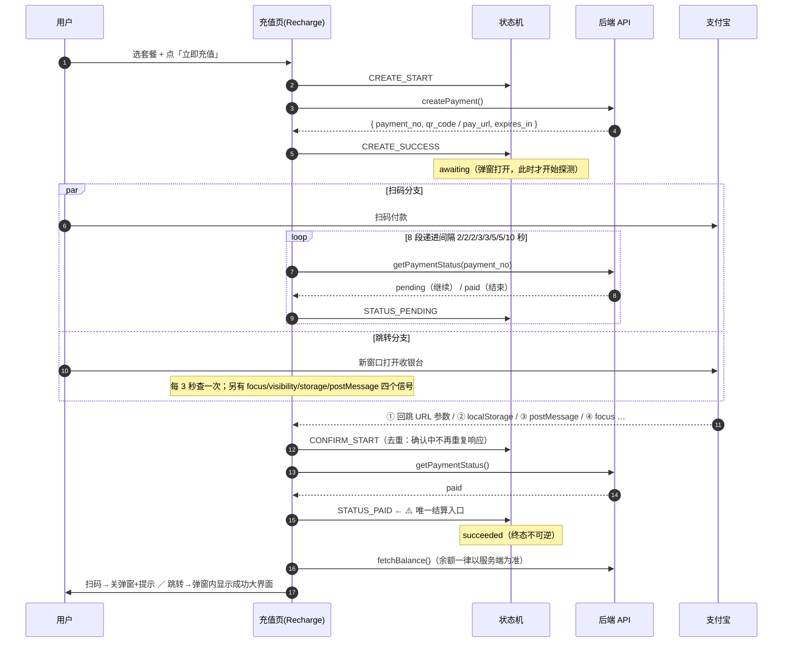
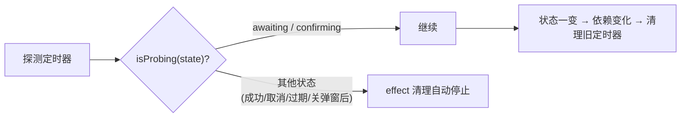
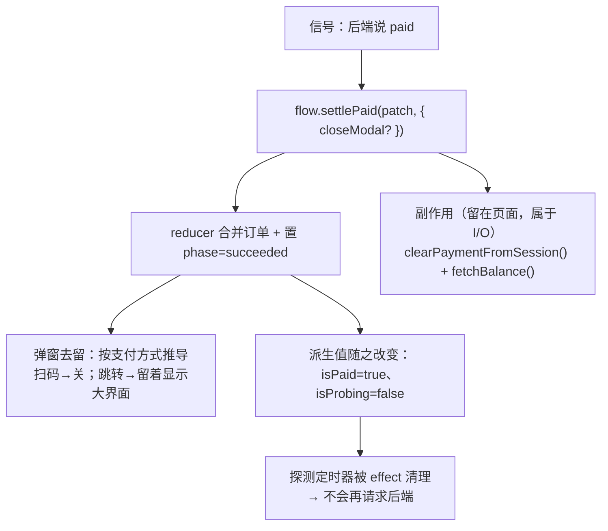

# 支付流程架构 · 状态机 · 信号流转（图文详解）

> 对象：`src/pages/developer/Recharge.tsx`（充值中心，资金链路）
> 配套文档：[`payment-flow-refactor.md`](payment-flow-refactor.md)（重构**方案书**：问题清单 / 迁移步骤 / 风险矩阵）
> 本文是**讲清楚"现在长什么样、为什么这样、怎么读代码"**的图文版，小白与专家都能各取所需。

---

## 0. 三分钟速览（先看这段就够用）

**业务上发生了什么**：用户在充值页选套餐 → 点「立即充值」→ 系统创建一笔支付单 →
用户去支付宝付款（扫码，或跳到支付宝页面）→ 系统**从多个渠道探听"到底付没付"** →
确认后把余额刷新、界面切到「充值成功」。

**一句话类比**：

| 现实 | 代码里的概念 |
|---|---|
| 点单 | `creating` → `created()` |
| 等餐（后厨在做） | `awaiting` |
| 服务员反复去后厨问「好了没」 | **探测**（`isProbing` 为真时才有定时器） |
| 客人催单时，服务员先去核对 | `confirming` |
| 上菜 | `succeeded`（**唯一结算入口**） |
| 客人退单 / 菜凉了 | `cancelled` / `expired` |

**最该记住的一条规则（也是曾经出过缺陷的地方）**：

> **菜已经上了、或者客人已经退单了，后厨再说"好了"我们也不认。**
> 代码里叫「**终态不可逆**」：`succeeded` / `cancelled` / `expired` 这三个状态收到任何
> 「支付状态更新」都一律忽略 —— 这从根上消灭了「**已经取消的订单被轮询回报 paid 后标记成支付成功**」这类缺陷。

---

## 1. 重构前 vs 重构后（一张图看懂为什么要改）

### 1.1 重构前：一个事实，**七处各自实现**



问题不在"来源多"（支付本来就有多种回调渠道），而在**每个来源都要自己把"成功"翻译成状态变更**：
同一段 6 行结算逻辑在文件里出现了 **7 次**（`postMessage` 内部还重复两份），
于是**状态被切碎**（9 个 state/ref），只好再造一个 `paymentStateRef` 手工同步"最新状态"（典型的"第二份真相"）。

### 1.2 重构后：**一个状态机 + 一个结算入口**



**关键变化**：

| | 重构前 | 重构后 |
|---|---|---|
| 生命周期状态 | 9 个 `useState/useRef`，散落各处 | **1 个 reducer**（`PaymentState`） |
| "成功"的实现处数 | **7 处** | **1 处**（`STATUS_PAID` 分支） |
| 派生值（是否成功/是否确认中…） | 各自一个 `useState`，可能互相矛盾 | **从状态推导，不落库**（不可能矛盾） |
| 第二份真相 `paymentStateRef` | 需要（手工同步） | **已删除**（M3 会彻底清掉与之配套的两套轮询） |
| 页面里的 `setState` | 35 处 | **0 处**（全部走语义化 action） |

---

## 2. 架构分层图（谁依赖谁）



**依赖方向是硬约束（单向、无环）**：

```
页面 → 编排 hook → 纯函数 machine
视图组件 ← 页面（只收 props / 回调，不反向 import 页面）
```

> ⚠️ 为什么强调"单向"：重构前 `repos/repoColumns.tsx` 这类模块**差点**演化成
> "常量要调 `navigate` → 反过来 import 页面 → 循环依赖"。所以列定义/控件一律用**工厂函数或受控组件**。

---

## 3. 状态机图（8 个状态 · 13 个事件）



**状态含义速查**：

| 状态 | 含义 | 弹窗 | 会去探测后端吗 | 能关弹窗吗 |
|---|---|---|---|---|
| `idle` | 没有进行中的订单 | 关 | ✗ | — |
| `creating` | 正在创建订单 | 关 | ✗ | — |
| `awaiting` | 订单已建，等用户付款 | **开** | **✓** | ✓ |
| `confirming` | 收到"可能成功"信号，正在核对 | 开 | ✓ | ✗（防误操作） |
| `succeeded` | 支付成功 | 开（显示成功大界面） | ✗ | ✗ |
| `failed` | 创建/支付失败 | 关 | ✗ | ✓ |
| `cancelled` | 用户取消 | 关 | ✗ | ✓ |
| `expired` | 订单超时 | 开 | ✗ | ✓ |

**13 个事件（谁在什么时候派发）**：

| 事件 | 典型触发点 |
|---|---|
| `CREATE_START` / `CREATE_SUCCESS` / `CREATE_FAILURE` | 点「立即充值」后下单成功/失败 |
| `RESTORE_FOUND` | 挂载时从 `sessionStorage` 恢复；或"只有 order_no"时的占位单 |
| `STATUS_PAID` | **所有**成功信号（回调 / storage / postMessage / 轮询 / 手动刷新） |
| `STATUS_PENDING` | 探测完成但后端仍是未支付（可带订单补丁） |
| `ORDER_PATCH` | 只改订单字段（如刷新二维码），**不动状态、不推进探测计数** |
| `CONFIRM_START` | 收到同步回调 / postMessage 这类强信号 |
| `CANCEL` / `CLOSE` / `OPEN` / `EXPIRE` / `RESET` | 用户操作 / 订单超时 |

---

## 4. 信号流转图（7 类信号 → 一次结算）



**四条"停止"路径（都不再依赖"谁记得调 stop"）**：



---

## 5. 数据流：一次"支付成功"到底改了哪些东西



> 注意分工：**状态变化归 reducer（纯函数）**，**I/O 归页面/hook**。
> 这条边界让"状态迁移"可以用 21 条纯函数用例穷举，而不用起 jsdom。

---

## 6. 专家向：这套设计守住了哪些不变式

| 不变式 | 在哪保证 | 用哪条用例锁住 |
|---|---|---|
| **终态不可逆**（取消/过期单不得被标记成功） | reducer 的 `isTerminal` 守卫 | `TC-FE-PAYMACH-008`（+ 页面级 `TC-FE-RECHARGE-013`） |
| **结算只有一个入口** | 只有 `STATUS_PAID` 会写 `succeeded` | `TC-FE-PAYMACH-007` |
| **幂等**（重复结算/重复信号不重复生效） | 终态守卫 + `confirming` 去重 | `TC-FE-PAYMACH-009/010` |
| **探测开关是派生的** | `isProbing(state)` | `TC-FE-PAYMACH-015` |
| **弹窗去留不由调用方随手决定** | `STATUS_PAID` 按 `mode` 推导，例外用 `closeModal` 显式覆盖 | `TC-FE-PAYMACH-019` |
| **订单补丁不推进探测节奏** | 独立的 `ORDER_PATCH` 事件 | `TC-FE-PAYMACH-021` |
| **扫码间隔表与既有实现逐值一致** | `QR_PROBE_INTERVALS` 常量 | `TC-FE-PAYMACH-016/017` |

**与主流支付架构经验的对照（7 项共识）**：

| 主流共识 | 本实现 | 结论 |
|---|---|---|
| 显式状态机，禁止自由组合的布尔量 | 8 状态机器 + 派生值不落库 | ✅ |
| 幂等：同一事件重复到达不得重复生效 | 终态不可逆 + 单入口 + `confirming` | ✅ |
| 轮询渐进退避 + 终止条件 | 8 段递进；跑满给人工刷新指引 | ✅ |
| webhook 才是入账真相，前端只呈现 | 余额一律 `fetchBalance()` | ✅ |
| 前端要能对账 | 结算后强制刷新余额 + 手动「刷新状态」 | ✅ |
| 副作用与状态迁移分离 | 纯函数 machine + 编排 hook | ✅ |
| **绝不以客户端信号判定支付成功** | 四条路径（`storage` 事件 / `checkPaymentResult` 读 localStorage / `postMessage`×2）统一走 `confirmPaymentWithServer()`：只把客户端信号当**触发**，一律 `getPaymentStatus` 向后端求证，**仅后端说 paid/completed 才结算** | ✅ **已补（M5）** |

> M5 已落地（2026-09-17）：四条"客户端可写"路径都改为**只作为触发信号**——先进 `confirming`，
> 再 `getPaymentStatus` 向后端求证，由服务端回答决定是否结算；后端说未支付或请求失败一律**不结算**。
> 防的正是这个场景：在控制台执行
> `localStorage.setItem('payment_success_result','{"outTradeNo":"x","status":"paid"}')`
> 就能让页面显示「充值成功」（改造前如此，一分钱没付）。用例 `TC-FE-RECHARGE-022/023` 成对锁住该性质，
> 变异规则 `FIX-10/11` 证明其有效；顺带修掉"挂载恢复时后端已说 paid 却停在等待支付"的反向缺陷（024）。
> 详见 [`payment-flow-refactor.md` §2.5](payment-flow-refactor.md) 与 test-log「轮次 M5」。

---

## 7. 专题：`act` 警告能不能"全部解决"？

### 7.1 先给结论

> **不能"全部解决"，但可以把 88 条压到接近 0。**
> 根因**不是"setState 太多"，而是"状态更新发生在测试的 `act` 边界之外"**。
> 重构带来的 102 → 88 是**减少更新源**的副产品，不是根治。
>
> 📌 **2026-09-17 补记（M4-lite 落地后）**：应用层已做完 —— 实测 **88 → 81**，
> 详见 §7.5（含**归因口径修正**：本章 §7.2 原先给的是"并行跑"的按文件归因，会串台；真值见 §7.5）。

### 7.2 取证（2026-09-17 全量实测，日志 `70`）

`act: update not wrapped in act` = **88 条**（M4-lite 前），归因如下：

| 按 spec 文件 | 条数 | | 按"触发更新的组件" | 条数 |
|---|---|---|---|---|
| `Recharge.spec.tsx` | **82** | | `DeveloperRecharge`（**业务状态**） | **41** |
| `Analytics.spec.tsx` | 6 | | `EllipsisMeasure`（antd 内部） | 18 |
| | | | `ForwardRef`（antd 内部） | 12 |
| | | | `Button`（antd 内部） | 8 |
| | | | `AdminAnalytics`（业务状态） | 6 |
| | | | `Portal` / `Root`（React/antd 内部） | 3 |

> ⚠️ **上表的按文件数字取自"并行跑"，口径有缺陷**（vitest 多 worker 时 `stderr` 的归属标记会串台）。
> 已用"串行跑 + 单文件跑"两条路径复核，修正值见 §7.5 —— 结论方向不变，但数字要以 §7.5 为准。

按用例看，集中在**"下单"类**用例（都在创建订单后、测试结束前）。

**读法**：下单成功后组件会启动**倒计时（每秒 tick）+ 轮询（2~10 秒/次）**，
而测试在断言完就结束了 —— 那些定时器回调落在 `act` 窗口之外，于是每次都报一条。
**这与"业务代码写得脏不脏"无关，是"带真实定时器的组件 + 真实定时器的测试"的固有摩擦。**

### 7.3 三层解法与代价

| 层 | 做法 | 能消掉多少 | 代价 / 风险 |
|---|---|---|---|
| **① 应用层**（减少更新源） | · 倒计时改为**由 `expiresAt` 派生** + 单个 ticker，且**弹窗关闭即停**（现状：只要有 pending 订单就每秒 tick，即使弹窗已关）<br/>· 「5 秒后自动刷新」的 `setTimeout` 改为 effect（卸载即取消） | 估计 **20~35 条**（`DeveloperRecharge` 的一部分） | 需改 `Recharge`，属 M4（`useCountdown`）范围；**顺带是真收益**（少一个常驻定时器、少一次无意义渲染） |
| **② 测试层**（把定时器推进纳入 act 边界） | 对含定时器的页面统一用 **fake timers**：`vi.useFakeTimers()` + `act(() => vi.advanceTimersByTime(3000))`；或所有等待都用 `await act(async () => …)` 包裹 | 可压到 **接近 0**（含 antd 内部那 41 条） | 需改造 013/014/005 等用例（`userEvent` 要配 `advanceTimers`）、`waitFor` 语义要相应调整；**改造面较大** |
| **③ 第三方层**（antd 内部 41 条） | 无业务侧解法 | 只能靠 ② 一并覆盖 | `EllipsisMeasure`/`Button`/`Portal` 都是随我们的渲染而更新，不因渲染而更新是不可能的 |

### 7.4 建议的推进顺序（务实）

1. **先做 ①**（应用层）：它同时是**真实的生产改进**（弹窗关闭后不再空转定时器），且改动面小、有 18 条用例兜底；
2. 再做 ②，但**只挑"重定时器"的 spec**（`Recharge.spec.tsx` + `Analytics.spec.tsx`）改 fake timers —— 其余 29 个 spec 的警告已接近 0，不必动；
3. 每压掉一批就 `npm run test:budget -- --update-baseline` 重建基线（**基线只减不增**：某类一旦从基线消失，再出现即判失败）；
4. ③ 无需单独处理 —— ② 覆盖后它自然归零。

> ⚠️ **提醒**：`act` 警告**不是"测试写得不对"的罪证**。它是"测试的观察窗口没盖住组件的异步行为"的提示。
> 现有 013/014 已经用 `await act(async () => …)` 显式包裹了长等待，属于正确做法；
> 残余警告来自"测试结束/卸载时仍在跑的定时器"。**真正必须守住的是行为断言** ——
> 这一点已由 7 条变异规则（`FIX-1~7`）证明。

---

### 7.5 补记：M4-lite 落地 + 归因口径修正（2026-09-17）

#### 7.5.1 做了什么（应用层，即 §7.3 的 ①）

| 项 | 改造前 | 改造后 |
|---|---|---|
| 剩余有效期 | `useState(0)` + 每秒 `setCountdown(c => c - 1)` | **由 `expiresAt` 派生**（每次用 `Date.now()` 重算） |
| 定时器开关 | 只看"订单 pending" —— **关弹窗后仍每秒 tick** | `flow.isModalOpen && flow.isProbing` —— **关弹窗/进终态即停表** |
| 缺失 `expires_in` | 页面手工 `setCountdown(600)` | hook 内兜底 600 秒（机器 `expiresAt=null` 的语义被 `TC-FE-PAYMACH-004` 锁住，故兜底留在 hook） |
| tick 迟到/被节流 | **永久漂移**（只做 `-1`，永不自我纠正） | **自我纠正**（按真实时间重算） |

落地文件：新增 `recharge/useCountdown.ts`（79 行）+ 3 条假定时器用例；
`Recharge.tsx` 去掉 4 处 `setCountdown` 与那个 effect；`constants.calculateRemainingSeconds` 成为死代码、已删。

#### 7.5.2 复测与归因修正（关键）

**归因**（串行跑与单文件跑相互印证，替代 §7.2 的按文件数字）：

| 按 spec 文件 | 条数 | | 按"触发更新的组件" | 条数 |
|---|---|---|---|---|
| `Recharge.spec.tsx` | **75** | | `DeveloperRecharge`（业务状态） | **34** |
| `Analytics.spec.tsx` | 6 | | `EllipsisMeasure`（antd 内部） | 18 |
| | | | `ForwardRef`（antd 内部） | 12 |
| | | | `Button`（antd 内部） | 8 |
| | | | `AdminAnalytics`（业务状态） | 6 |
| | | | `Portal` 2 / `Root` 1 | 3 |

**总量**：88 → **81**（`npm run test:budget`，同口径前后对比）。

#### 7.5.3 ⚠️ 比数字更重要的一条：这个指标**不干净**，别读绝对值

实测到一个反直觉现象：同一个 `Recharge.spec.tsx`，

- 与 `useCountdown.spec.ts` **两个文件**一起跑 → **1 条**；
- **单独一个文件**跑 → **75 条**；
- 全量 32 个文件并行跑 → **81 条**（其中 75 归它）。

也就是说**同一文件的警告数会随"文件集与线程调度"变化两个数量级**。
原因trace：`act` 警告产生于"更新落在测试的 `act` 窗口之外"，而这完全取决于
**定时器回调相对于被测用例的时间竞争**（并发时事件循环更忙、回调更晚、更容易落到窗口外）。
结论与纪律：

1. **绝对数字只用于"同口径前后对比"**（同一条命令、同样的文件集、同样的并行度）；
2. **别把"act 警告少了"当成功指标**，它是**副产品**（真正的收益是"少一个空转定时器"）；
3. 真正可靠的指标是**变异检验**（9/9 有效）与**行为断言**；
4. 按项目约定"修好一类就下调基线"：本轮已 `--update-baseline` 锁定 **act 81 / jsdom 177**。

#### 7.5.4 剩下的 81 条怎么办

- **测试层（②）**是唯一系统解：给"带真实定时器的两个 spec"（`Recharge.spec` / `Analytics.spec`）
  上 fake timers，把定时器推进包进 `act` —— 可覆盖含 antd 内部（`EllipsisMeasure` 18 / `ForwardRef` 12 /
  `Button` 8 / `Portal` 2 / `Root` 1 = **41 条**）在内的全部残留；
- 代价明确：`userEvent` 需配 `advanceTimers`、`waitFor` 语义要逐个调整，属**较大改造**，
  且**改造期间可能削弱行为断言** → 必须跑变异检验复验（9/9 不能掉）。
- 因此本轮**主动停在 ①**，不追这个数字。

## 8. 术语表 & 文件清单

| 术语 | 含义 |
|---|---|
| **结算（settle）** | 把"支付成功"落到 UI 状态上（`STATUS_PAID`），并触发清 session / 刷余额 |
| **探测（probe）** | 向后端查一次支付状态（`getPaymentStatus`） |
| **强信号** | 明确暗示"可能已支付"的外部事件（同步回调 / postMessage）→ 进 `confirming` |
| **终态** | `succeeded` / `cancelled` / `expired`，不可逆 |
| **派生值** | 由状态算出来的布尔量（`isPaid` 等），**不单独存 state** |

| 文件 | 角色 |
|---|---|
| `recharge/payment/paymentMachine.ts` | 状态机（纯函数，231 行） |
| `recharge/payment/paymentMachine.spec.ts` | 21 条纯函数用例（零 jsdom） |
| `recharge/payment/usePaymentFlow.ts` | 编排 hook：`useReducer` + 语义 action + 派生值 |
| `recharge/useCountdown.ts` | 剩余有效期倒计时（**派生自 `expiresAt`**，关弹窗即停表） |
| `recharge/useDelayedReload.ts` | 结算后延迟刷新（**卸载即取消**、重复调度只留最后一次；M3-c₁） |
| `recharge/payment/usePaymentProbe.ts` | 统一探测调度（start 捕获 mode/单号；探测动作按模式分流；卸载即停） |
| `recharge/components/PaymentModal.tsx` | 支付弹窗三态 |
| `Recharge.tsx` | 页面：渲染 + 数据加载 + I/O（**无生命周期 setState**） |

---

*本文随 `M2-2` 提交生成；`M4-lite`（倒计时派生 + 关弹窗即停表）见 §7.5，`M5`（客户端信号不得直接结算）已落地（§6 最后一行）。
后续 M3（探测统一、删 `paymentStateRef`）/ M4 余项（`usePaymentWindow`）落地时应同步更新第 2、4、6、7 章。*
