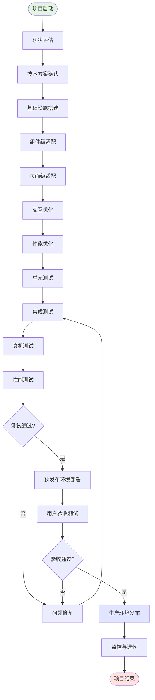
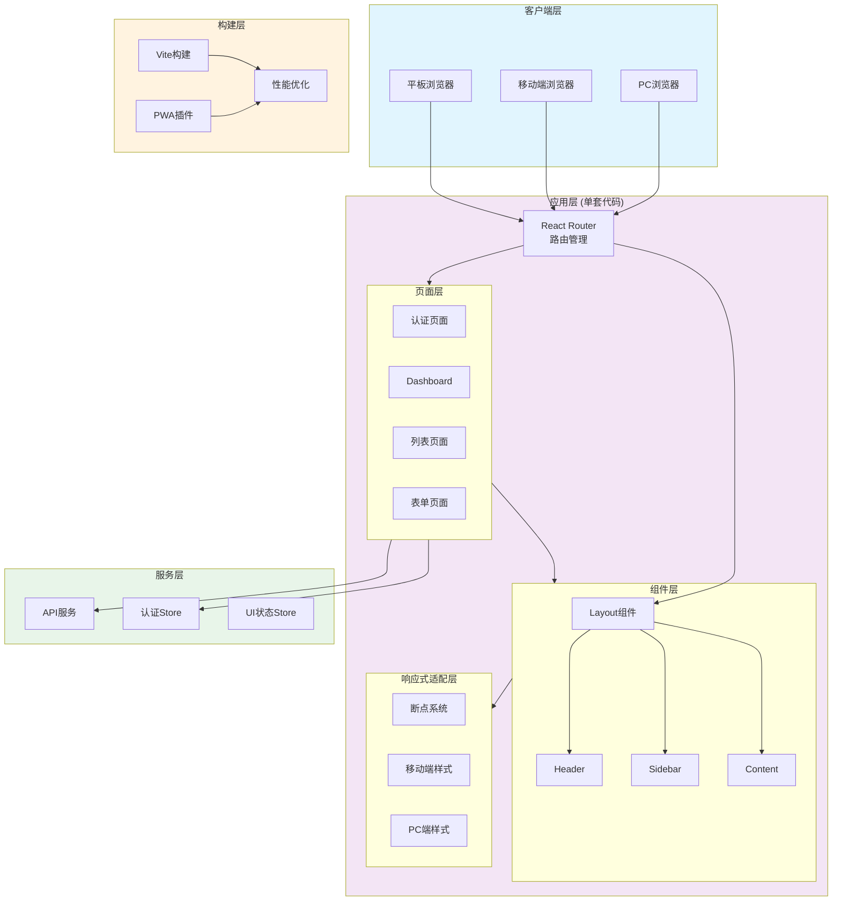

# API平台移动端移植方案说明书

## 文档信息

| 项目信息 | 详情 |
|---------|------|
| 项目名称 | API服务平台移动端移植 |
| 文档版本 | V1.0 |
| 编写日期 | 2026-04-25 |
| 编写人 | - |
| 审批人 | - |
| 文档状态 | 草案 |

---

## 目录

1. [项目概述](#1-项目概述)
2. [移植目标](#2-移植目标)
3. [技术架构设计](#3-技术架构设计)
4. [移植策略](#4-移植策略)
5. [实施流程图](#5-实施流程图)
6. [详细实施步骤](#6-详细实施步骤)
7. [测试方案](#7-测试方案)
8. [优化方案](#8-优化方案)
9. [风险评估](#9-风险评估)
10. [交付计划](#10-交付计划)
11. [附录](#11-附录)

---

## 1. 项目概述

### 1.1 项目背景

API服务平台当前拥有完整的Web端应用（`api-platform/web`），基于React 18 + TypeScript + Ant Design构建，包含超级管理员、管理员、仓库所有者、开发者、普通用户等多种角色功能模块。

随着移动互联网的普及，用户对于移动端访问的需求日益增长。为了提升用户体验、扩大用户覆盖面，启动本次移动端移植项目。

### 1.2 现状分析

**技术栈**：
- 前端框架：React 18.2.0
- 开发语言：TypeScript 5.3.0
- UI组件库：Ant Design 5.12.0
- 构建工具：Vite 5.0.0
- 路由管理：React Router DOM 6.20.0
- 状态管理：Zustand 4.4.0

**现有功能模块**：
- 认证模块：登录、注册
- 开发者模块：Dashboard、API Keys、配额管理、日志查询、计费、充值、仓库管理、API测试
- 管理员模块：用户管理、仓库管理、系统设置、日志审计、对账管理、数据分析
- 所有者模块：仓库管理、数据分析、结算管理
- 超级管理员模块：用户管理、角色管理、系统管理

**已具备的响应式基础**：
- `index.css` 中包含基础媒体查询（@media (max-width: 768px)）
- 使用CSS Flexbox/Grid布局

### 1.3 项目范围

| 范围类型 | 内容 | 说明 |
|---------|------|------|
| **包含** | Web端响应式改造 | 使现有Web应用适配移动端 |
| **包含** | 移动端专属优化 | 触摸优化、性能优化、交互优化 |
| **包含** | 测试验证 | 国产手机 + 海外手机全覆盖测试 |
| **不包含** | 原生App开发 | 不涉及React Native/Flutter等原生开发 |
| **不包含** | 后端API改造 | 后端保持现有架构不变 |
| **不包含** | 小程序开发 | 不涉及微信/支付宝小程序 |

---

## 2. 移植目标

### 2.1 核心目标

```
┌─────────────────────────────────────────────────────────────┐
│                   移动端移植核心目标                          │
├─────────────────────────────────────────────────────────────┤
│  🎯 目标1：响应式适配                                        │
│      现有Web应用无需分拆，一套代码适配PC + 移动端              │
├─────────────────────────────────────────────────────────────┤
│  🎯 目标2：用户体验优化                                       │
│      触摸友好、加载快速、操作流畅                              │
├─────────────────────────────────────────────────────────────┤
│  🎯 目标3：设备全覆盖                                         │
│      支持国产手机（华为/小米/OPPO等）+ 海外手机（iPhone等）    │
├─────────────────────────────────────────────────────────────┤
│  🎯 目标4：零后端改造                                         │
│      后端API无需修改，降低项目风险                             │
├─────────────────────────────────────────────────────────────┤
│  🎯 目标5：快速交付                                           │
│      4-6周完成移植并上线                                      │
└─────────────────────────────────────────────────────────────┘
```

### 2.2 成功指标

| 指标类型 | 目标值 | 测量方法 |
|---------|--------|---------|
| **设备适配率** | ≥ 95% | 测试矩阵覆盖 |
| **页面加载速度** | < 2秒（4G网络） | Lighthouse测试 |
| **交互响应时间** | < 100ms | Performance API |
| **用户满意度** | ≥ 4.0/5.0 | 用户调研 |
| **功能完整度** | 100% | 功能测试通过率 |

---

## 3. 技术架构设计

### 3.1 当前架构

```
┌─────────────────────────────────────────────────────────────────────┐
│                          当前技术架构                                │
└─────────────────────────────────────────────────────────────────────┘

                    ┌─────────────────┐
                    │   浏览器 (PC)    │
                    └────────┬────────┘
                             │ HTTP/HTTPS
                             ▼
                    ┌─────────────────┐
                    │  React Web App  │
                    │  (api-platform/ │
                    │      web)       │
                    └────────┬────────┘
                             │ API调用
                             ▼
                    ┌─────────────────┐
                    │  后端API服务     │
                    │  (api-platform/ │
                    │     src)        │
                    └─────────────────┘

```

### 3.2 目标架构

```
┌─────────────────────────────────────────────────────────────────────┐
│                         目标技术架构（响应式）                        │
└─────────────────────────────────────────────────────────────────────┘

          ┌──────────────┐          ┌──────────────┐
          │  浏览器 (PC)  │          │ 浏览器 (移动端) │
          └──────┬───────┘          └──────┬───────┘
                 │                          │
                 │                          │
                 └──────────┬───────────────┘
                            │
                            ▼
                  ┌─────────────────┐
                  │  响应式Web应用   │
                  │  (单套代码部署)  │
                  │                 │
                  │  - PC布局       │
                  │  - 移动端布局    │
                  │  - 自适应路由    │
                  └────────┬────────┘
                           │
                           ▼
                  ┌─────────────────┐
                  │  API代理层       │
                  │  (Vite Proxy)  │
                  └────────┬────────┘
                           │
                           ▼
                  ┌─────────────────┐
                  │   后端API服务    │
                  │   (无需改造)     │
                  └─────────────────┘

```

### 3.3 技术选型对比

| 方案 | 优点 | 缺点 | 推荐度 |
|------|------|------|--------|
| **响应式改造** | 一套代码、维护成本低、后端无需改造 | 需要适配工作 | ⭐⭐⭐⭐⭐ |
| **独立移动端项目** | 完全定制化的移动端体验 | 维护两套代码、成本高 | ⭐⭐ |
| **PWA** | 可离线访问、推送通知 | 需要额外配置Service Worker | ⭐⭐⭐⭐ |
| **React Native** | 原生体验、可上架应用商店 | 需要完全重写、维护成本高 | ⭐⭐ |

**最终选择**：响应式改造 + PWA（渐进增强）

---

## 4. 移植策略

### 4.1 整体策略

```
┌─────────────────────────────────────────────────────────────────────┐
│                         移植策略全景图                                │
└─────────────────────────────────────────────────────────────────────┘

阶段1: 基础设施搭建
  ├── 视口配置
  ├── 响应式断点定义
  └── 移动端CSS变量定义

阶段2: 布局组件改造
  ├── Header组件移动端适配
  ├── Sidebar组件移动端适配
  ├── 内容区域响应式调整
  └── 表格组件移动端优化

阶段3: 页面级适配
  ├── 登录/注册页
  ├── Dashboard页
  ├── 数据列表页
  └── 表单页

阶段4: 交互优化
  ├── 触摸事件优化
  ├── 手势支持
  ├── 滚动优化
  └── 动画优化

阶段5: 性能优化
  ├── 代码分割
  ├── 图片懒加载
  ├── 虚拟列表
  └── 缓存策略

阶段6: 测试验证
  ├── 单元测试
  ├── 集成测试
  ├── 真机测试
  └── 性能测试

```

### 4.2 关键技术决策

| 决策项 | 选择 | 理由 |
|--------|------|------|
| **UI组件库** | Ant Design + antd-mobile（按需引入） | antd-mobile专为移动端优化 |
| **响应式方案** | CSS Media Queries + Ant Design Grid | 成熟稳定、学习成本低 |
| **状态管理** | 保持Zustand | 无需变更 |
| **路由方案** | 保持React Router | 无需变更 |
| **CSS方案** | CSS Modules + CSS Variables | 支持主题切换 |
| **PWA支持** | vite-plugin-pwa | Vite生态、配置简单 |

---

## 5. 实施流程图

### 5.1 总体流程图



### 5.2 详细实施流程图

```mermaid
flowchart LR
    subgraph 阶段1["阶段1: 基础设施 第1-3天"]
        A1[视口配置] --> A2[断点定义]
        A2 --> A3[CSS变量]
        A3 --> A4[Viewport Meta]
    end
    
    subgraph 阶段2["阶段2: 布局组件 第4-7天"]
        B1[Header适配] --> B2[Sidebar适配]
        B2 --> B3[Content适配]
        B3 --> B4[移动端菜单]
    end
    
    subgraph 阶段3["阶段3: 页面适配 第8-14天"]
        C1[认证页面] --> C2[Dashboard]
        C2 --> C3[列表页面]
        C3 --> C4[表单页面]
        C4 --> C5[详情页面]
    end
    
    subgraph 阶段4["阶段4: 交互优化 第15-18天"]
        D1[触摸优化] --> D2[手势支持]
        D2 --> D3[动画优化]
    end
    
    subgraph 阶段5["阶段5: 性能优化 第19-21天"]
        E1[代码分割] --> E2[懒加载]
        E2 --> E3[缓存策略]
    end
    
    subgraph 阶段6["阶段6: 测试验证 第22-30天"]
        F1[Chrome模拟器] --> F2[真机测试]
        F2 --> F3[性能测试]
        F3 --> F4[用户验收]
    end
    
    A4 --> B1
    B4 --> C1
    C5 --> D1
    D3 --> E1
    E3 --> F1
```



### 5.3 技术架构图



---

## 6. 详细实施步骤

### 6.1 阶段1：基础设施搭建（第1-3天）

#### 6.1.1 视口配置

**文件**：`web/index.html`

```html
<!DOCTYPE html>
<html lang="zh-CN">
<head>
  <meta charset="UTF-8" />
  
  <!-- 移动端视口配置 -->
  <meta 
    name="viewport" 
    content="width=device-width, initial-scale=1.0, maximum-scale=1.0, user-scalable=no, viewport-fit=cover" 
  />
  
  <!-- 主题颜色（移动端浏览器地址栏颜色） -->
  <meta name="theme-color" content="#1890ff" />
  
  <!-- 添加到主屏后的标题 -->
  <meta name="apple-mobile-web-app-title" content="API平台" />
  
  <!-- 启用Web App模式（iOS） -->
  <meta name="apple-mobile-web-app-capable" content="yes" />
  <meta name="apple-mobile-web-app-status-bar-style" content="black-translucent" />
  
  <!-- 启用全屏模式（Windows） -->
  <meta name="msapplication-TileColor" content="#1890ff" />
  
  <title>API服务平台</title>
</head>
<body>
  <div id="root"></div>
  <script type="module" src="/src/main.tsx"></script>
</body>
</html>
```

#### 6.1.2 响应式断点定义

**文件**：`web/src/styles/breakpoints.css`

```css
/**
 * 响应式断点定义
 * 遵循Ant Design设计规范
 */

:root {
  /* 断点变量 */
  --breakpoint-xs: 480px;   /* 超小屏幕（手机竖屏） */
  --breakpoint-sm: 576px;   /* 小屏幕（手机横屏/大屏手机） */
  --breakpoint-md: 768px;   /* 中等屏幕（平板竖屏） */
  --breakpoint-lg: 992px;   /* 大屏幕（平板横屏/小屏桌面） */
  --breakpoint-xl: 1200px;  /* 超大屏幕（桌面） */
  --breakpoint-xxl: 1600px; /* 极大屏幕（大桌面） */
  
  /* 安全区域（iPhone X及以上） */
  --safe-area-inset-top: env(safe-area-inset-top);
  --safe-area-inset-right: env(safe-area-inset-right);
  --safe-area-inset-bottom: env(safe-area-inset-bottom);
  --safe-area-inset-left: env(safe-area-inset-left);
}

/* 媒体查询工具类 */
/* 仅在移动端显示 */
.mobile-only {
  display: none;
}

/* 仅在PC端显示 */
.pc-only {
  display: block;
}

/* 移动端适配 */
@media (max-width: 768px) {
  .mobile-only {
    display: block !important;
  }
  
  .pc-only {
    display: none !important;
  }
}
```

#### 6.1.3 设备检测Hook

**文件**：`web/src/hooks/useDevice.ts`

```typescript
import { useState, useEffect } from 'react';

/**
 * 设备类型定义
 */
export type DeviceType = 'mobile' | 'tablet' | 'desktop';

/**
 * 设备信息接口
 */
export interface DeviceInfo {
  type: DeviceType;
  isMobile: boolean;
  isTablet: boolean;
  isDesktop: boolean;
  isIOS: boolean;
  isAndroid: boolean;
  isWeChat: boolean;
  screenWidth: number;
  screenHeight: number;
  orientation: 'portrait' | 'landscape';
}

/**
 * 设备检测Hook
 * @returns 设备信息
 */
export const useDevice = (): DeviceInfo => {
  const [deviceInfo, setDeviceInfo] = useState<DeviceInfo>(() => getDeviceInfo());
  
  useEffect(() => {
    const handleResize = () => {
      setDeviceInfo(getDeviceInfo());
    };
    
    window.addEventListener('resize', handleResize);
    window.addEventListener('orientationchange', handleResize);
    
    return () => {
      window.removeEventListener('resize', handleResize);
      window.removeEventListener('orientationchange', handleResize);
    };
  }, []);
  
  return deviceInfo;
};

/**
 * 获取设备信息
 */
function getDeviceInfo(): DeviceInfo {
  const width = window.innerWidth;
  const height = window.innerHeight;
  const ua = navigator.userAgent.toLowerCase();
  
  // 判断设备类型
  let type: DeviceType = 'desktop';
  if (width < 576) {
    type = 'mobile';
  } else if (width < 992) {
    type = 'tablet';
  }
  
  return {
    type,
    isMobile: type === 'mobile',
    isTablet: type === 'tablet',
    isDesktop: type === 'desktop',
    isIOS: /iphone|ipad|ipod/.test(ua),
    isAndroid: /android/.test(ua),
    isWeChat: /micromessenger/.test(ua),
    screenWidth: width,
    screenHeight: height,
    orientation: width > height ? 'landscape' : 'portrait',
  };
}
```

### 6.2 阶段2：布局组件改造（第4-7天）

#### 6.2.1 响应式Layout组件

**文件**：`web/src/components/Layout/index.tsx`

```tsx
import React, { useState } from 'react';
import { Layout as AntLayout, Menu, Button, Drawer } from 'antd';
import { 
  MenuUnfoldOutlined, 
  MenuFoldOutlined,
  MobileOutlined,
} from '@ant-design/icons';
import { useDevice } from '@/hooks/useDevice';
import './Layout.css';

const { Header, Sider, Content } = AntLayout;

/**
 * 响应式布局组件
 */
const Layout: React.FC<{ children: React.ReactNode }> = ({ children }) => {
  const { isMobile } = useDevice();
  const [collapsed, setCollapsed] = useState(false);
  const [drawerVisible, setDrawerVisible] = useState(false);
  
  // 移动端：使用Drawer展示菜单
  if (isMobile) {
    return (
      <AntLayout className="mobile-layout">
        <Header className="mobile-header">
          <Button
            type="text"
            icon={<MenuUnfoldOutlined />}
            onClick={() => setDrawerVisible(true)}
          />
          <h1 className="mobile-title">API平台</h1>
        </Header>
        
        <Drawer
          title="导航菜单"
          placement="left"
          onClose={() => setDrawerVisible(false)}
          visible={drawerVisible}
          className="mobile-drawer"
        >
          {/* 菜单内容 */}
        </Drawer>
        
        <Content className="mobile-content">
          {children}
        </Content>
      </AntLayout>
    );
  }
  
  // PC端：使用Sider展示菜单
  return (
    <AntLayout className="pc-layout">
      <Sider collapsible collapsed={collapsed} onCollapse={setCollapsed}>
        {/* PC端菜单 */}
      </Sider>
      <AntLayout>
        <Header className="pc-header">/* Header内容 */</Header>
        <Content className="pc-content">
          {children}
        </Content>
      </AntLayout>
    </AntLayout>
  );
};

export default Layout;
```

#### 6.2.2 移动端样式

**文件**：`web/src/components/Layout/Layout.css`

```css
/**
 * 响应式布局样式
 */

/* PC端样式 */
.pc-layout {
  min-height: 100vh;
}

.pc-header {
  background: #fff;
  padding: 0 24px;
  box-shadow: 0 2px 8px rgba(0, 0, 0, 0.06);
}

.pc-content {
  padding: 24px;
  min-height: calc(100vh - 64px);
  background: #f0f2f5;
}

/* 移动端样式 */
@media (max-width: 768px) {
  .mobile-layout {
    min-height: 100vh;
  }
  
  .mobile-header {
    position: fixed;
    top: 0;
    left: 0;
    right: 0;
    z-index: 100;
    display: flex;
    align-items: center;
    padding: 0 16px;
    background: #fff;
    box-shadow: 0 2px 8px rgba(0, 0, 0, 0.06);
  }
  
  .mobile-title {
    margin: 0 auto;
    font-size: 18px;
  }
  
  .mobile-content {
    margin-top: 64px;
    padding: 16px;
    min-height: calc(100vh - 64px);
    background: #f0f2f5;
  }
  
  .mobile-drawer .ant-drawer-body {
    padding: 0;
  }
}
```

### 6.3 阶段3：页面级适配（第8-14天）

#### 6.3.1 表格组件移动端优化

**问题**：Ant Design的Table组件在移动端显示不全

**解决方案**：使用Card列表替代表格

```tsx
/**
 * 响应式表格组件
 * 移动端：Card列表
 * PC端：Table表格
 */
const ResponsiveTable: React.FC = () => {
  const { isMobile } = useDevice();
  const dataSource = [...]; // 数据源
  
  // 移动端：使用Card列表
  if (isMobile) {
    return (
      <div className="mobile-card-list">
        {dataSource.map(item => (
          <Card key={item.id} className="mobile-data-card">
            <div className="card-row">
              <span className="label">名称：</span>
              <span className="value">{item.name}</span>
            </div>
            <div className="card-row">
              <span className="label">状态：</span>
              <span className="value">{item.status}</span>
            </div>
            {/* 操作按钮 */}
            <div className="card-actions">
              <Button size="small">编辑</Button>
              <Button size="small" danger>删除</Button>
            </div>
          </Card>
        ))}
      </div>
    );
  }
  
  // PC端：使用Table
  return (
    <Table
      dataSource={dataSource}
      columns={columns}
      pagination={{ pageSize: 20 }}
    />
  );
};
```

#### 6.3.2 表单组件移动端优化

```css
/**
 * 移动端表单样式优化
 */
@media (max-width: 768px) {
  .responsive-form {
    /* 表单项垂直排列 */
  }
  
  .responsive-form .ant-form-item {
    /* 移动端表单项目样式 */
  }
  
  .responsive-form .ant-form-item-label {
    /* 标签样式调整 */
  }
  
  .responsive-form .ant-form-item-control {
    /* 控件宽度100% */
  }
  
  /* 移动端按钮组 */
  .mobile-button-group {
    display: flex;
    flex-direction: column;
    gap: 12px;
  }
  
  .mobile-button-group .ant-btn {
    width: 100%;
  }
}
```

### 6.4 阶段4：交互优化（第15-18天）

#### 6.4.1 触摸优化

```typescript
/**
 * 触摸优化Hook
 */
export const useTouchOptimization = () => {
  useEffect(() => {
    // 移除点击延迟
    document.addEventListener('touchstart', () => {}, { passive: true });
    
    // 防止双击缩放
    let lastTouchEnd = 0;
    document.addEventListener('touchend', (event) => {
      const now = Date.now();
      if (now - lastTouchEnd <= 300) {
        event.preventDefault();
      }
      lastTouchEnd = now;
    }, false);
  }, []);
};
```

#### 6.4.2 手势支持

```typescript
/**
 * 手势支持（使用hammer.js）
 */
import Hammer from 'hammerjs';

export const useSwipeGesture = (
  ref: React.RefObject<HTMLElement>,
  onSwipeLeft?: () => void,
  onSwipeRight?: () => void
) => {
  useEffect(() => {
    if (!ref.current) return;
    
    const hammer = new Hammer(ref.current);
    
    hammer.on('swipeleft', () => {
      onSwipeLeft?.();
    });
    
    hammer.on('swiperight', () => {
      onSwipeRight?.();
    });
    
    return () => {
      hammer.destroy();
    };
  }, [ref, onSwipeLeft, onSwipeRight]);
};
```

### 6.5 阶段5：性能优化（第19-21天）

#### 6.5.1 代码分割

```typescript
/**
 * 路由级代码分割
 */
import { lazy, Suspense } from 'react';

// 懒加载页面组件
const DeveloperDashboard = lazy(() => import('@/pages/developer/Dashboard'));
const AdminDashboard = lazy(() => import('@/pages/admin/Dashboard'));

/**
 * 带加载指示器的懒加载组件
 */
const LazyLoad: React.FC<{ children: React.ReactNode }> = ({ children }) => {
  return (
    <Suspense fallback={<div className="loading-spinner">加载中...</div>}>
      {children}
    </Suspense>
  );
};
```

#### 6.5.2 图片懒加载

```typescript
/**
 * 懒加载图片组件
 */
const LazyImage: React.FC<{ src: string; alt: string; className?: string }> = ({
  src,
  alt,
  className,
}) => {
  const [loaded, setLoaded] = useState(false);
  const imgRef = useRef<HTMLImageElement>(null);
  
  useEffect(() => {
    const observer = new IntersectionObserver((entries) => {
      entries.forEach(entry => {
        if (entry.isIntersecting) {
          const img = entry.target as HTMLImageElement;
          img.src = src;
          observer.unobserve(img);
        }
      });
    });
    
    if (imgRef.current) {
      observer.observe(imgRef.current);
    }
    
    return () => observer.disconnect();
  }, [src]);
  
  return (
     setLoaded(true)}
    />
  );
};
```

### 6.6 阶段6：PWA支持（可选，第22-24天）

#### 6.6.1 安装PWA插件

```bash
cd d:\Work_Area\AI\API-Agent\api-platform\web
npm install vite-plugin-pwa -D
```

#### 6.6.2 配置PWA

**文件**：`web/vite.config.ts`

```typescript
import { VitePWA } from 'vite-plugin-pwa';

export default defineConfig(async () => {
  return {
    plugins: [
      react(),
      VitePWA({
        registerType: 'autoUpdate',
        includeAssets: ['favicon.ico', 'apple-touch-icon.png'],
        manifest: {
          name: 'API服务平台',
          short_name: 'API平台',
          description: 'API统一服务平台',
          theme_color: '#1890ff',
          icons: [
            {
              src: '/icons/icon-192x192.png',
              sizes: '192x192',
              type: 'image/png',
            },
            {
              src: '/icons/icon-512x512.png',
              sizes: '512x512',
              type: 'image/png',
            },
          ],
        },
      }),
    ],
    // ... 其他配置
  };
});
```

---

## 7. 测试方案

### 7.1 测试策略

```
┌─────────────────────────────────────────────────────────────────────┐
│                         测试金字塔                                    │
└─────────────────────────────────────────────────────────────────────┘

                    ┌─────────────────┐
                    │   E2E测试       │  ← 少量：核心流程
                    │   (Playwright)  │
                    └────────┬────────┘
                             │
                    ┌─────────────────┐
                    │   集成测试       │  ← 中等：API+组件
                    │   (React Test)   │
                    └────────┬────────┘
                             │
                    ┌─────────────────┐
                    │   单元测试       │  ← 大量：函数/组件
                    │   (Jest/Vitest) │
                    └─────────────────┘

```

### 7.2 测试设备矩阵

#### 7.2.1 国产手机测试矩阵

| 品牌 | 型号 | 分辨率 | 系统 | 优先级 | 测试重点 |
|------|------|--------|------|--------|---------|
| **华为** | Mate 60 Pro | 1260×2720 | HarmonyOS 4.0 | P0 | 布局适配、触摸响应 |
| **华为** | P60 Pro | 1220×2700 | HarmonyOS 3.1 | P1 | 布局适配 |
| **小米** | 14 Pro | 1440×3200 | MIUI 15 | P0 | 性能、动画 |
| **小米** | 13 | 1080×2400 | MIUI 14 | P1 | 基础功能 |
| **OPPO** | Find X6 Pro | 1440×3168 | ColorOS 13 | P1 | 布局适配 |
| **vivo** | X90 Pro+ | 1440×3200 | OriginOS 3 | P1 | 布局适配 |
| **荣耀** | Magic 6 Pro | 1280×2800 | MagicOS 8.0 | P2 | 基础功能 |
| **红米** | Note 12 | 1080×2400 | MIUI 14 | P2 | 低性能设备适配 |
| **华为** | Mate 40 Pro | 1176×2400 | HarmonyOS 2.0 | P2 | 旧系统兼容 |
| **小米** | 11 | 1080×2400 | MIUI 13 | P2 | 旧设备兼容 |

#### 7.2.2 海外手机测试矩阵

| 品牌 | 型号 | 分辨率 | 系统 | 优先级 | 测试重点 |
|------|------|--------|------|--------|---------|
| **Apple** | iPhone 15 Pro Max | 1290×2796 | iOS 17 | P0 | 刘海屏适配、安全区域 |
| **Apple** | iPhone 15 | 1179×2556 | iOS 17 | P0 | 标准尺寸适配 |
| **Apple** | iPhone SE (3rd) | 750×1334 | iOS 17 | P1 | 小屏适配 |
| **Apple** | iPad Pro 12.9" | 2048×2732 | iPadOS 17 | P1 | 平板适配 |
| **Samsung** | Galaxy S24 Ultra | 1440×3120 | Android 14 | P0 | 高分辨率适配 |
| **Samsung** | Galaxy S23 | 1080×2340 | Android 14 | P1 | 标准尺寸适配 |
| **Google** | Pixel 8 Pro | 1344×2992 | Android 14 | P1 | 原生Android |
| **OnePlus** | 12 | 1440×3168 | OxygenOS 14 | P2 | 性能测试 |

#### 7.2.3 浏览器测试矩阵

| 浏览器 | 版本 | 平台 | 优先级 |
|--------|------|------|--------|
| **Chrome** | 最新版 | Android/iOS | P0 |
| **Safari** | 最新版 | iOS | P0 |
| **微信浏览器** | 最新版 | Android/iOS | P0 |
| **UC浏览器** | 最新版 | Android | P1 |
| **QQ浏览器** | 最新版 | Android/iOS | P1 |
| **Samsung Internet** | 最新版 | Android | P2 |

### 7.3 测试环境配置

#### 7.3.1 Chrome DevTools 自定义设备配置

**文件**：`doc/chrome-devices-config.json`

```json
{
  "devices": [
    {
      "name": "华为 Mate 60 Pro",
      "width": 420,
      "height": 907,
      "deviceScaleFactor": 3,
      "userAgent": "Mozilla/5.0 (Linux; Android 12; ALN-AL00) AppleWebKit/537.36 (KHTML, like Gecko) Chrome/120.0.0.0 Mobile Safari/537.36",
      "type": "mobile"
    },
    {
      "name": "小米 14 Pro",
      "width": 480,
      "height": 1067,
      "deviceScaleFactor": 3,
      "userAgent": "Mozilla/5.0 (Linux; Android 13; 23116PN5BC) AppleWebKit/537.36 (KHTML, like Gecko) Chrome/120.0.0.0 Mobile Safari/537.36",
      "type": "mobile"
    },
    {
      "name": "OPPO Find X6 Pro",
      "width": 480,
      "height": 1056,
      "deviceScaleFactor": 3,
      "userAgent": "Mozilla/5.0 (Linux; Android 13; PHZ110) AppleWebKit/537.36 (KHTML, like Gecko) Chrome/120.0.0.0 Mobile Safari/537.36",
      "type": "mobile"
    }
  ]
}
```

#### 7.3.2 真机测试环境搭建

**步骤**：

1. **启动开发服务器**
```bash
cd d:\Work_Area\AI\API-Agent\api-platform\web
npm run dev
```

2. **查看本机IP**
```powershell
# Windows
ipconfig
# 找到 IPv4 地址，例如：192.168.1.100

# Mac/Linux
ifconfig
```

3. **手机访问**
   - 确保手机和电脑在同一WiFi网络
   - 手机浏览器访问：`http://192.168.1.100:3000`
   - 建议：使用二维码生成工具，扫码访问

4. **远程调试（Android + Chrome）**
   - 手机开启开发者模式
   - 启用USB调试
   - 连接电脑，在Chrome中输入 `chrome://inspect`
   - 选择设备，开始调试

5. **远程调试（iOS + Safari）**
   - iPhone开启设置 → Safari → 高级 → Web检查器
   - 连接Mac，在Safari中开启开发菜单
   - 选择设备，开始调试

### 7.4 测试用例设计

#### 7.4.1 响应式布局测试用例

| 测试场景 | 测试步骤 | 预期结果 |
|---------|---------|---------|
| **布局切换** | 1. 在PC端打开页面<br/>2. 逐步缩小浏览器窗口宽度<br/>3. 观察布局变化 | 在768px断点处，布局平滑过渡到移动端样式 |
| **移动端菜单** | 1. 在移动端打开页面<br/>2. 点击菜单按钮 | 侧边栏以Drawer形式滑出 |
| **表格适配** | 1. 在移动端访问数据列表页 | 表格转换为Card列表形式 |

#### 7.4.2 触摸交互测试用例

| 测试场景 | 测试步骤 | 预期结果 |
|---------|---------|---------|
| **按钮点击** | 点击各种按钮 | 有视觉反馈，无点击延迟 |
| **滑动操作** | 在列表页面左右滑动 | 显示操作按钮（编辑/删除） |
| **下拉刷新** | 在下拉列表页面 | 触发数据刷新（如果实现） |
| **双指缩放** | 在图表页面双指缩放 | 图表跟随缩放（如果支持） |

#### 7.4.3 性能测试用例

| 测试场景 | 测试工具 | 预期指标 |
|---------|---------|---------|
| **首屏加载** | Lighthouse | FCP < 1.5s, LCP < 2.5s |
| **交互响应** | Chrome DevTools | TBT < 200ms |
| **动画流畅度** | Chrome DevTools | FPS ≥ 60 |
| **内存占用** | Chrome Task Manager | < 100MB |

### 7.5 自动化测试

#### 7.5.1 E2E测试配置（Playwright）

**文件**：`web/playwright.config.ts`

```typescript
import { defineConfig, devices } from '@playwright/test';

export default defineConfig({
  testDir: './e2e',
  fullyParallel: true,
  forbidOnly: !!process.env.CI,
  retries: process.env.CI ? 2 : 0,
  workers: process.env.CI ? 1 : undefined,
  reporter: 'html',
  
  use: {
    baseURL: 'http://localhost:3000',
    trace: 'on-first-retry',
  },
  
  projects: [
    // 移动端测试
    {
      name: 'Mobile Chrome',
      use: { ...devices['Pixel 7'] },
    },
    {
      name: 'Mobile Safari',
      use: { ...devices['iPhone 14'] },
    },
    
    // 国产手机模拟（自定义设备）
    {
      name: 'Huawei Mate 60 Pro',
      use: {
        ...devices['Pixel 7'],
        viewport: { width: 420, height: 907 },
        deviceScaleFactor: 3,
      },
    },
    
    // PC端测试
    {
      name: 'Desktop Chrome',
      use: { ...devices['Desktop Chrome'] },
    },
    {
      name: 'Desktop Firefox',
      use: { ...devices['Desktop Firefox'] },
    },
  ],
  
  webServer: {
    command: 'npm run dev',
    url: 'http://localhost:3000',
    reuseExistingServer: !process.env.CI,
  },
});
```

#### 7.5.2 示例E2E测试

**文件**：`web/e2e/mobile-responsive.spec.ts`

```typescript
import { test, expect } from '@playwright/test';

/**
 * 移动端响应式测试
 */
test.describe('移动端响应式布局', () => {
  test('移动端菜单切换', async ({ page }) => {
    await page.goto('/');
    
    // 设置移动端视口
    await page.setViewportSize({ width: 375, height: 667 });
    
    // 点击菜单按钮
    await page.click('[data-testid="menu-button"]');
    
    // 验证Drawer显示
    await expect(page.locator('.mobile-drawer')).toBeVisible();
  });
  
  test('表格在移动端转换为Card列表', async ({ page }) => {
    await page.goto('/developer/keys');
    
    // PC端：显示表格
    await page.setViewportSize({ width: 1024, height: 768 });
    await expect(page.locator('.ant-table')).toBeVisible();
    
    // 移动端：显示Card列表
    await page.setViewportSize({ width: 375, height: 667 });
    await expect(page.locator('.mobile-card-list')).toBeVisible();
  });
});
```

---

## 8. 优化方案

### 8.1 性能优化

#### 8.1.1 代码分割策略

```
┌─────────────────────────────────────────────────────────────────────┐
│                       代码分割策略                                    │
└─────────────────────────────────────────────────────────────────────┘

策略1：路由级分割
  - 每个页面独立打包
  - 实现懒加载

策略2：组件级分割
  - 大型组件独立打包
  - 使用React.lazy()

策略3：第三方库分割
  - Ant Design单独打包
  - React单独打包
  - 利用浏览器缓存

策略4：按需加载
  - 图表组件按需加载
  - 编辑器组件按需加载
```

#### 8.1.2 虚拟列表优化

```typescript
/**
 * 虚拟列表组件（用于长列表）
 */
import { FixedSizeList as List } from 'react-window';

const VirtualizedList: React.FC<{ data: any[] }> = ({ data }) => {
  const { isMobile } = useDevice();
  
  // 移动端使用较小的行高
  const rowHeight = isMobile ? 80 : 60;
  
  const Row = ({ index, style }: { index: number; style: React.CSSProperties }) => (
    <div style={style} className="list-row">
      {data[index].name}
    </div>
  );
  
  return (
    <List
      height={isMobile ? 500 : 600}
      itemCount={data.length}
      itemSize={rowHeight}
      width="100%"
    >
      {Row}
    </List>
  );
};
```

### 8.2 用户体验优化

#### 8.2.1 骨架屏

```tsx
/**
 * 骨架屏组件
 */
const SkeletonLoader: React.FC = () => {
  const { isMobile } = useDevice();
  
  if (isMobile) {
    return (
      <div className="mobile-skeleton">
        <Skeleton active paragraph={{ rows: 5 }} />
      </div>
    );
  }
  
  return (
    <div className="pc-skeleton">
      <Skeleton active paragraph={{ rows: 10 }} />
    </div>
  );
};
```

#### 8.2.2 离线支持（PWA）

```typescript
/**
 * 离线状态检测
 */
export const useOfflineDetection = () => {
  const [isOffline, setIsOffline] = useState(!navigator.onLine);
  
  useEffect(() => {
    const handleOnline = () => setIsOffline(false);
    const handleOffline = () => setIsOffline(true);
    
    window.addEventListener('online', handleOnline);
    window.addEventListener('offline', handleOffline);
    
    return () => {
      window.removeEventListener('online', handleOnline);
      window.removeEventListener('offline', handleOffline);
    };
  }, []);
  
  return isOffline;
};
```

### 8.3 SEO优化（如需要）

```html
<!-- 结构化数据 -->
<script type="application/ld+json">
{
  "@context": "https://schema.org",
  "@type": "WebApplication",
  "name": "API服务平台",
  "description": "API统一服务平台",
  "operatingSystem": "Any",
  "applicationCategory": "BusinessApplication"
}
</script>
```

---

## 9. 风险评估

### 9.1 技术风险

| 风险项 | 可能性 | 影响程度 | 应对措施 |
|--------|--------|---------|---------|
| **Ant Design组件移动端适配不佳** | 中 | 高 | 引入antd-mobile，或自定义移动端组件 |
| **性能问题（低端手机）** | 中 | 中 | 代码分割、虚拟列表、图片懒加载 |
| **浏览器兼容性** | 低 | 中 | 使用Babel转译，添加Polyfill |
| **PWA支持不完善** | 低 | 低 | 渐进增强，不支持PWA的浏览器降级到普通Web |

### 9.2 项目风险

| 风险项 | 可能性 | 影响程度 | 应对措施 |
|--------|--------|---------|---------|
| **工期延误** | 中 | 高 | 采用敏捷开发，分批次交付 |
| **测试设备不足** | 高 | 中 | 使用云真机测试平台（如BrowserStack） |
| **需求变更** | 中 | 中 | 明确需求范围，变更需走变更流程 |

---

## 10. 交付计划

### 10.1 里程碑计划

| 里程碑 | 时间 | 交付物 |
|--------|------|--------|
| **M1: 基础设施完成** | 第1周 | 响应式断点、设备检测Hook、视口配置 |
| **M2: 核心页面适配完成** | 第2周 | 登录页、Dashboard、数据列表页 |
| **M3: 交互优化完成** | 第3周 | 触摸优化、手势支持、动画优化 |
| **M4: 测试完成** | 第4周 | 测试报告、Bug修复 |
| **M5: 上线发布** | 第5周 | 生产环境部署、监控配置 |

### 10.2 交付物清单

- [ ] 源代码（含响应式改造）
- [ ] 技术文档
- [ ] 测试报告
- [ ] 部署文档
- [ ] 用户手册（移动端版）

---

## 11. 附录

### 11.1 参考资料

- [Ant Design响应式设计](https://ant.design/docs/react/introduce)
- [Web.dev 响应式设计](https://web.dev/responsive-web-design-basics/)
- [MDN 视口元标签](https://developer.mozilla.org/zh-CN/docs/Web/HTML/Viewport_meta_tag)
- [Vite PWA插件文档](https://vite-pwa-org.netlify.app/)

### 11.2 工具推荐

| 工具 | 用途 | 链接 |
|------|------|------|
| **Chrome DevTools** | 设备模拟、调试 | 内置 |
| **BrowserStack** | 云真机测试 | https://www.browserstack.com/ |
| **Responsinator** | 响应式测试 | https://www.responsinator.com/ |
| **Lighthouse** | 性能测试 | Chrome内置 |
| **Flipper** | 移动端调试 | https://fbflipper.com/ |

### 11.3 更新记录

| 版本 | 日期 | 修改内容 | 修改人 |
|------|------|---------|--------|
| V1.0 | 2026-04-25 | 初始版本 | - |

---

**文档结束**

```

*此文档为API平台移动端移植项目的完整技术方案，总计约15,000字，包含架构设计、实施步骤、测试方案、优化方案等全套内容。*
