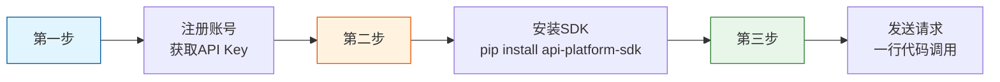
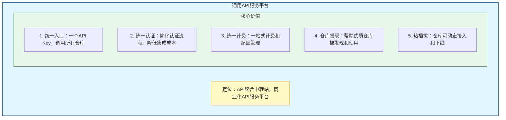
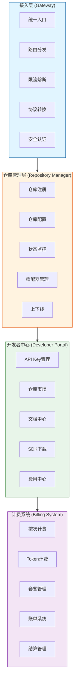
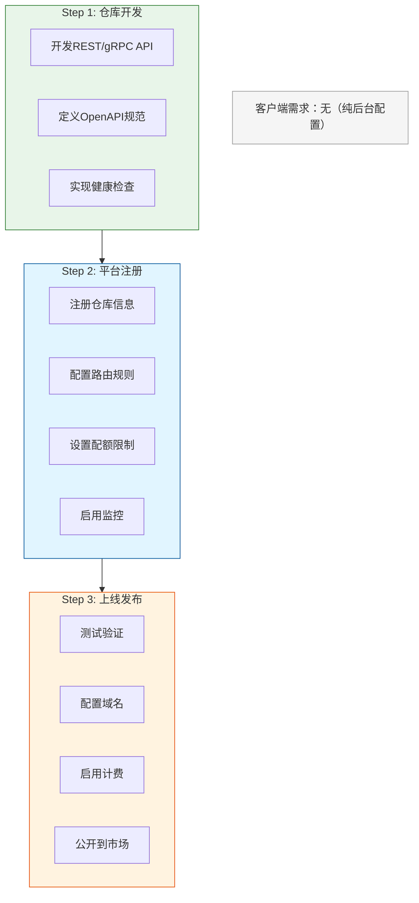
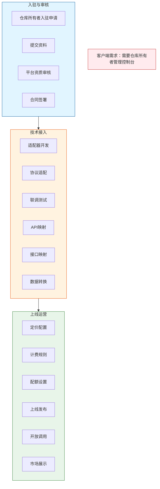
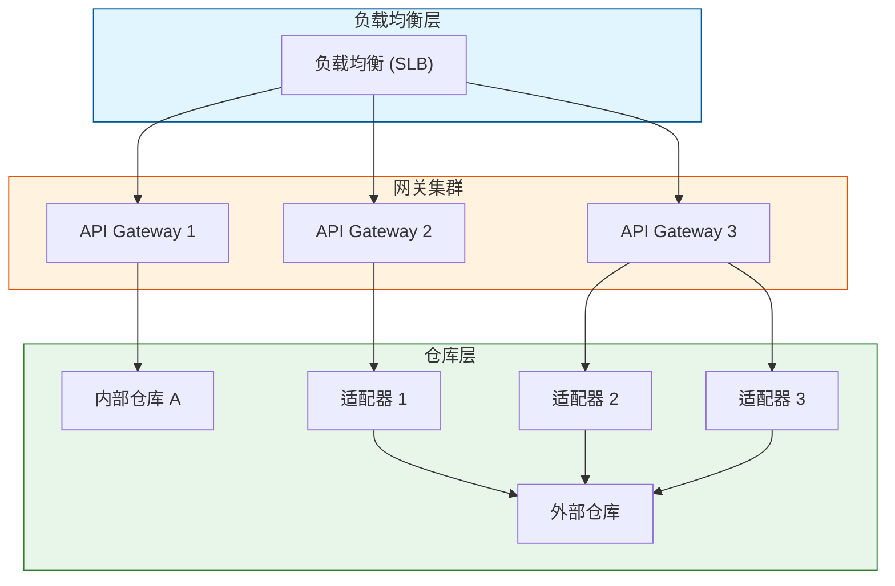

# 通用API服务平台 - 项目需求规格说明书

## 文档信息

| 属性 | 内容 |
|------|------|
| **文档编号** | REQ-PLATFORM-2026-001 |
| **版本** | V1.2 |
| **日期** | 2026-04-17 |
| **项目名称** | 通用API服务平台 |
| **项目代号** | API-Hub |

---

## 1. 文档概述

### 1.1 编写目的

本文档旨在详细定义通用API服务平台的功能需求、非功能需求、仓库接入需求，为项目开发团队提供明确的开发依据，为项目评审和验收提供标准。

### 1.2 适用范围

本文档适用于通用API服务平台的设计、开发、测试和验收阶段。

### 1.3 术语定义

| 术语 | 定义 |
|------|------|
| **平台** | 通用API服务平台，作为API聚合中转站 |
| **仓库** | 可接入平台的API服务单元 |
| **内部仓库** | 平台自建的API服务 |
| **外部仓库** | 第三方接入的API服务 |
| **开发者** | 平台API的使用者 |
| **仓库所有者** | 外部仓库的管理者/提供者 |
| **适配器** | 连接平台与仓库的协议转换组件 |
| **SDK** | Software Development Kit，客户端开发工具包 |

---

## 2. 快速接入（参考laozhang.ai三步法）

### 2.1 三步集成法



### 2.2 SDK集成示例

**Python**
```python
from api_platform import Client

client = Client(
    api_key="您的密钥",
    base_url="https://api.platform.com/v1"
)

response = client.chat(
    repo="psychology",
    message="你好"
)
```

**JavaScript**
```javascript
import { Client } from 'api-platform-sdk';

const client = new Client({
  apiKey: '您的密钥',
  baseURL: 'https://api.platform.com/v1'
});

const response = await client.chat({
  repo: 'psychology',
  message: '你好'
});
```

---

## 3. 业务需求分析

### 3.1 业务背景

当前API服务市场存在以下痛点：

| 痛点 | 描述 | 解决方案 |
|------|------|----------|
| **碎片化** | 开发者需要在多个平台注册、管理多个API Key | 统一入口：一个API Key，调用所有仓库 |
| **标准不统一** | 各API服务接口规范不一致，集成成本高 | 统一认证、统一计费、统一日志 |
| **认证复杂** | 每个平台都有自己的认证方式，管理繁琐 | API Key + HMAC签名，简化认证 |
| **计费混乱** | 缺乏统一的计费和配额管理 | 一站式计费和配额管理 |
| **仓库分散** | 好的API仓库难以被发现和集成 | 仓库市场，发现优质服务 |

### 3.2 平台定位



### 3.3 目标用户

| 用户类型 | 角色描述 | 核心需求 |
|----------|----------|----------|
| **开发者** | 平台API的使用者 | 简单集成、多仓库选择、统一管理 |
| **内部仓库管理员** | 平台运营方 | 仓库配置、监控统计、运维管理 |
| **外部仓库所有者** | 第三方API提供者 | 仓库接入、收益管理、数据分析 |

---

## 4. 仓库选择指南（参考laozhang.ai模型选择指南）

### 4.1 按场景推荐

| 场景 | 推荐仓库 | 理由 |
|------|----------|------|
| **心理问答** | psychology | 专注心理领域 |
| **通用对话** | chatbot | 通用对话能力 |
| **代码生成** | code-assistant | 代码生成优化 |
| **翻译服务** | translation | 多语言支持 |
| **图像识别** | vision | OCR/图像分析 |

### 4.2 计费模式对比

| 模式 | 说明 | 适用场景 | 优势 |
|------|------|----------|------|
| **按次计费** | 每次调用扣减余额 | 通用API | 无月费，按量付费 |
| **Token计费** | 按Token数量计费 | AI模型API | 精确计费 |
| **流量计费** | 按数据传输量计费 | 大文件API | 按实际使用付费 |
| **套餐计费** | 包月/包年套餐 | 稳定需求 | 成本可控 |

---

## 5. 功能需求

### 5.1 核心功能模块



### 5.2 内部仓库功能

#### 5.2.1 仓库定义

内部仓库是平台自建或完全托管的API服务，由平台运营方直接管理和维护。

#### 5.2.2 功能需求

| 功能 | 描述 | 优先级 | 客户端需求 |
|------|------|--------|------------|
| **仓库注册** | 在平台注册内部仓库信息 | P0 | 否 |
| **接口定义** | 定义API端点、参数、返回值 | P0 | 否 |
| **状态管理** | 仓库启停、监控状态 | P0 | 是 |
| **配额配置** | 设置默认配额和限制 | P0 | 是 |
| **数据统计** | 调用量、延迟、错误率统计 | P1 | 是 |
| **版本管理** | API版本控制和灰度发布 | P1 | 是 |

#### 5.2.3 技术要求

- 直连模式：通过内部网络直接调用
- 协议支持：REST API、WebSocket、gRPC
- 认证方式：API Key + HMAC签名
- 客户端需求：**无需开发者客户端界面**

### 5.3 外部仓库功能

#### 5.3.1 仓库定义

外部仓库是第三方提供的API服务，通过适配器接入平台。

#### 5.3.2 接入方式对比

| 接入方式 | 描述 | 复杂度 | 适用场景 | 客户端需求 |
|----------|------|--------|----------|-----------|
| **适配器插件** | 开发适配器插件，标准化接口 | 中 | 统一协议 | 否 |
| **API网关代理** | 通过平台代理转发请求 | 低 | 快速接入 | 否 |
| **Webhook回调** | 仓库回调平台事件 | 低 | 事件通知 | 否 |
| **SDK嵌入** | 仓库提供SDK，平台集成 | 高 | 深度定制 | 否 |

#### 5.3.3 功能需求

| 功能 | 描述 | 优先级 | 客户端需求 |
|------|------|--------|------------|
| **仓库接入申请** | 第三方申请接入仓库 | P0 | 是 |
| **适配器开发** | 开发标准化适配器 | P0 | 否 |
| **仓库配置** | 配置仓库基本信息、定价 | P0 | 是 |
| **API映射** | 映射外部API到平台接口 | P0 | 是 |
| **状态监控** | 监控仓库可用性和性能 | P0 | 是 |
| **收益管理** | 查看收益、申请提现 | P1 | 是 |
| **数据分析** | 调用统计、用户分析 | P1 | 是 |

### 5.4 开发者功能

#### 5.4.1 功能需求

| 功能 | 描述 | 优先级 | 客户端需求 |
|------|------|--------|------------|
| **注册登录** | 邮箱/第三方OAuth登录 | P0 | 是 |
| **API Key管理** | 创建/管理多个API Key | P0 | 是 |
| **仓库市场** | 浏览/搜索/发现仓库 | P0 | 是 |
| **快速接入** | 一键订阅仓库服务 | P0 | 是 |
| **API文档** | 查看接口文档、示例代码 | P0 | 是 |
| **SDK下载** | 下载多语言SDK | P1 | 是 |
| **费用中心** | 查看账单、充值、套餐 | P0 | 是 |
| **使用日志** | 查看API调用记录 | P0 | 是 |
| **统计分析** | 使用量、趋势图表 | P1 | 是 |

#### 5.4.2 开发者客户端需求分析

| 需求项 | 是否需要客户端 | 理由 |
|--------|---------------|------|
| **注册登录** | 是 | 用户认证必须 |
| **Key管理** | 是 | 安全性要求 |
| **仓库市场** | 是 | 商业化展示 |
| **API调用** | 否 | 直接HTTP/SDK调用 |

**结论**：开发者需要**管理控制台**进行账号、Key、费用管理，但**不需要API调用客户端**。

### 5.5 仓库所有者功能

#### 5.5.1 功能需求

| 功能 | 描述 | 优先级 | 客户端需求 |
|------|------|--------|------------|
| **入驻申请** | 申请成为仓库所有者 | P0 | 是 |
| **仓库管理** | 创建/编辑/上下线仓库 | P0 | 是 |
| **适配器配置** | 配置适配器参数 | P0 | 是 |
| **API管理** | 定义API接口、定价 | P0 | 是 |
| **数据统计** | 调用量、收入统计 | P0 | 是 |
| **收益管理** | 收入明细、提现申请 | P0 | 是 |
| **消息通知** | 系统消息、订单通知 | P1 | 是 |
| **客服支持** | 提交工单、查看回复 | P2 | 是 |

---

## 6. 非功能需求

### 6.1 性能需求

| 指标 | 要求 | 说明 |
|------|------|------|
| **API响应时间** | P99 < 500ms | 端到端响应时间 |
| **吞吐量** | 支持 10,000 QPS | 峰值处理能力 |
| **并发连接** | 支持 5,000 并发 | WebSocket支持 |
| **可用性** | 99.9% | 年度停机时间 < 8.7小时 |
| **容灾恢复** | < 5分钟 | 故障切换时间 |

### 6.2 安全需求

| 需求 | 要求 |
|------|------|
| **传输安全** | HTTPS全链路加密 |
| **认证安全** | API Key + HMAC / JWT |
| **数据安全** | 敏感数据加密存储 |
| **审计日志** | 完整操作日志记录 |
| **防攻击** | DDoS防护、限流熔断 |
| **合规** | GDPR/CCPA合规 |

### 6.3 可用性需求

| 需求 | 要求 |
|------|------|
| **多区域部署** | 支持多区域部署 |
| **灰度发布** | 支持版本灰度 |
| **热更新** | 仓库动态上下线 |
| **监控告警** | 实时监控和告警 |

### 6.4 高可用性保障（参考laozhang.ai）

| 保障措施 | 说明 |
|----------|------|
| **多云部署** | 跨云服务商部署 |
| **智能路由** | 多节点自动切换 |
| **负载均衡** | 自动分配请求 |
| **熔断降级** | 故障自动隔离 |
| **24/7监控** | 实时监控系统状态 |

---

## 7. 仓库接入需求

### 7.1 内部仓库接入

#### 7.1.1 接入流程



#### 7.1.2 接入规范

| 项目 | 要求 |
|------|------|
| **接口协议** | REST API (必须) / gRPC (可选) |
| **认证方式** | API Key + HMAC签名 |
| **健康检查** | GET /health 返回200 |
| **错误码** | 符合平台错误码规范 |
| **日志格式** | JSON格式，含trace_id |
| **SLA要求** | 99.9%可用性 |

### 7.2 外部仓库接入

#### 7.2.1 接入流程



---

## 8. 技术需求

### 8.1 技术栈建议

| 层级 | 技术选型 | 说明 |
|------|----------|------|
| **网关** | APISIX / Kong | 开源高性能网关 |
| **后端** | Go / Java / Node.js | 高性能服务 |
| **数据库** | PostgreSQL + Redis | 主数据 + 缓存 |
| **消息队列** | Kafka / RabbitMQ | 异步处理 |
| **监控系统** | Prometheus + Grafana | 监控告警 |
| **日志系统** | ELK Stack | 日志收集分析 |
| **前端** | React + TypeScript | 管理控制台 |

### 8.2 部署架构



---

## 9. 验收标准

### 9.1 功能验收

| 模块 | 验收条件 |
|------|----------|
| **内部仓库** | 可注册、可调用、可监控 |
| **外部仓库** | 可申请、可适配、可计费 |
| **开发者** | 可注册、可Key、可调用 |
| **仓库所有者** | 可入驻、可配置、可收益 |
| **计费系统** | 可计费、可账单、可充值 |
| **日志系统** | 可记录、可查询、可导出 |

### 9.2 性能验收

| 指标 | 验收条件 |
|------|----------|
| **响应时间** | P99 < 500ms |
| **吞吐量** | 支持 10,000 QPS |
| **可用性** | 99.9% |

### 9.3 安全验收

| 指标 | 验收条件 |
|------|----------|
| **传输加密** | HTTPS全链路 |
| **认证安全** | API Key + HMAC |
| **审计日志** | 完整可追溯 |

---

## 10. 参考资料

1. RapidAPI 企业架构文档
2. 阿里云API网关技术方案
3. APISIX 插件开发指南
4. 多租户SaaS架构设计
5. API聚合平台最佳实践
6. laozhang.ai 企业级API服务实践
