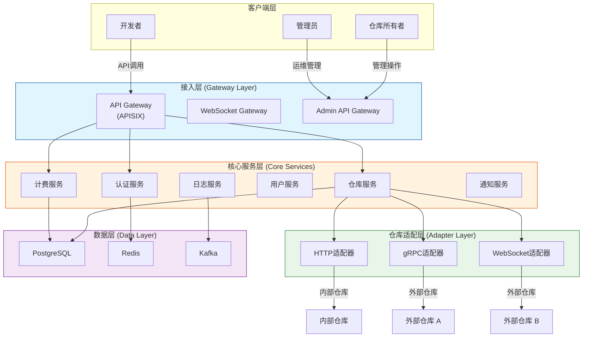
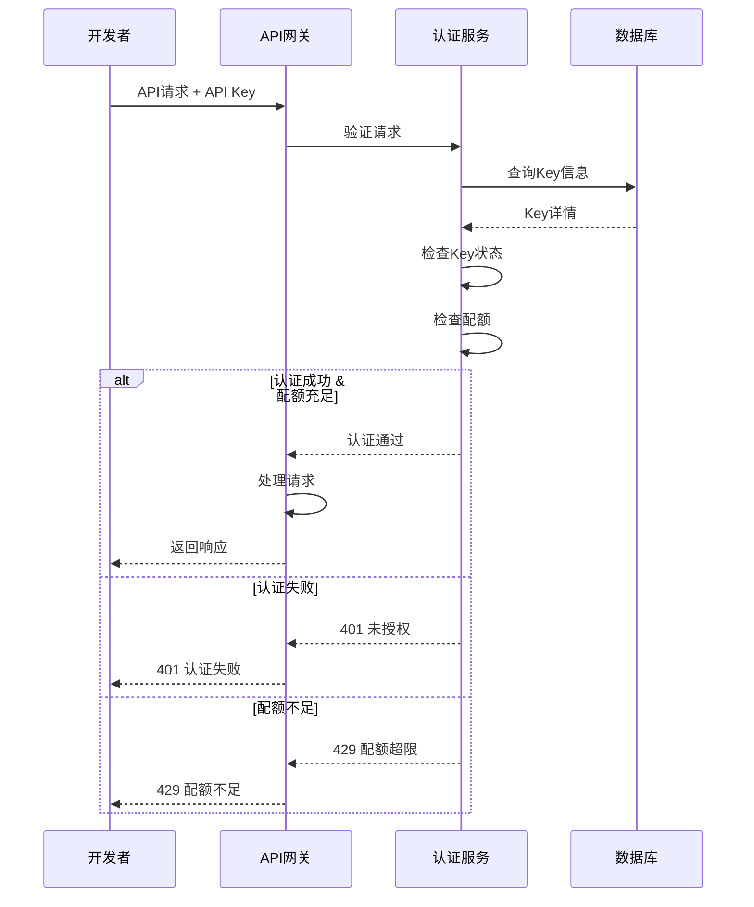
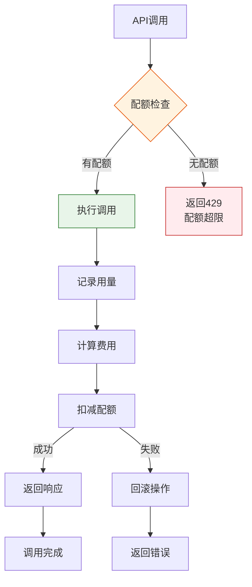

# 通用API服务平台 - 项目实施方案

## 文档信息

| 属性 | 内容 |
|------|------|
| **文档编号** | IMP-PLATFORM-2026-001 |
| **版本** | V1.2 |
| **日期** | 2026-04-17 |
| **项目名称** | 通用API服务平台 |
| **项目代号** | API-Hub |

---

## 1. 项目概述

### 1.1 项目背景

通用API服务平台旨在构建一个API聚合中转站，通过统一的入口、标准化的认证、智能的路由，将分散的API仓库整合起来，为开发者提供一站式的API服务体验，为仓库所有者提供商业化的变现渠道。

参考laozhang.ai平台实践，实现**三步集成**的极简接入体验。

### 1.2 项目目标

| 目标 | 描述 | 量化指标 |
|------|------|----------|
| **统一入口** | 一个API Key调用所有仓库 | 支持 50+ 仓库接入 |
| **热插拔** | 仓库可动态接入下线 | 接入时间 < 1小时 |
| **统一认证** | 简化认证流程 | 支持 3 种认证方式 |
| **统一计费** | 一站式计费管理 | 支持 4 种计费模式 |
| **高性能** | 高吞吐量低延迟 | 10,000 QPS / P99 < 500ms |
| **高可用** | 多云部署保障 | SLA 99.9% |

---

## 2. 技术架构设计

### 2.1 整体架构



### 2.2 高可用架构（参考laozhang.ai）

```mermaid
graph TB
    subgraph Cloud1["云服务商A"]
        GW1["API Gateway"]
        S1["Service 1"]
        DB1["Database"]
    end

    subgraph Cloud2["云服务商B"]
        GW2["API Gateway"]
        S2["Service 2"]
        DB2["Database"]
    end

    subgraph DNS["DNS负载均衡"]
        DNS["智能DNS<br/>健康检查"]
    end

    subgraph Cache["Redis集群"]
        R1["Redis主"]
        R2["Redis从"]
    end

    DNS -->|"流量分发"| GW1
    DNS -->|"流量分发"| GW2
    
    GW1 <-->|"数据同步"| GW2
    S1 <-->|"数据同步"| S2
    DB1 <-->|"主从复制"| DB2
    R1 <-->|"主从复制"| R2

    style Cloud1 fill:#e1f5ff,stroke:#01579b
    style Cloud2 fill:#e8f5e9,stroke:#2e7d32
    style DNS fill:#fff3e0,stroke:#e65100
    style Cache fill:#f3e5f5,stroke:#7b1fa2
```

**高可用特性**：
- 跨云服务商部署
- 智能DNS健康检查
- 自动故障切换
- 数据实时同步
- 多级缓存保障

### 2.3 核心组件设计

#### 2.3.1 API网关选型

| 网关 | 优势 | 劣势 | 推荐场景 |
|------|------|------|----------|
| **APISIX** | 高性能、K8s原生、插件丰富 | 社区较小 | **推荐** |
| **Kong** | 成熟稳定、插件多 | 性能一般 | 中小规模 |
| **NGINX** | 性能极高 | 扩展性差 | 超高并发 |
| **自研** | 完全可控 | 开发成本高 | 特殊需求 |

**推荐方案**：APISIX 作为核心网关

#### 2.3.2 网关功能模块

```yaml
# APISIX 配置示例
apisix:
  node_listen: 8080
  ssl_port: 8443

plugins:
  # 认证插件
  - api-key
  - jwt-auth
  - hmac-auth
  
  # 限流插件
  - limit-req
  - limit-count
  - limit-conn
  
  # 路由插件
  - proxy-rewrite
  - redirect
  
  # 监控插件
  - prometheus
  - skywalking
  
  # 自定义插件
  - billing-plugin      # 计费插件
  - adapter-plugin      # 适配器插件
  - repository-plugin   # 仓库路由插件
```

### 2.4 SDK集成方案（参考laozhang.ai）

#### 2.4.1 Python SDK

```python
# 安装
pip install api-platform-sdk

# 使用
from api_platform import Client

client = Client(
    api_key="您的密钥",
    base_url="https://api.platform.com/v1"
)

response = client.chat(
    repo="psychology",
    message="你好"
)
```

#### 2.4.2 JavaScript SDK

```javascript
// 安装
npm install api-platform-sdk

// 使用
import { Client } from 'api-platform-sdk';

const client = new Client({
  apiKey: '您的密钥',
  baseURL: 'https://api.platform.com/v1'
});

const response = await client.chat({
  repo: 'psychology',
  message: '你好'
});
```

### 2.5 认证方案设计

#### 2.5.1 认证流程



#### 2.5.2 认证方式实现

```typescript
// auth.service.ts

// 1. API Key 认证
export async function authenticateByAPIKey(
  apiKey: string
): Promise<AuthResult> {
  const key = await KeyModel.findOne({ key: apiKey });
  if (!key || key.status !== 'active') {
    return { success: false, error: 'INVALID_KEY' };
  }
  
  const quota = await checkQuota(key.userId, key.repoId);
  if (!quota.available) {
    return { success: false, error: 'QUOTA_EXCEEDED' };
  }
  
  return { success: true, userId: key.userId, keyId: key.id };
}

// 2. HMAC 签名认证
export async function authenticateByHMAC(
  headers: RequestHeaders,
  body: string
): Promise<AuthResult> {
  const { Signature, Timestamp, Nonce, AccessKey } = headers;
  
  const now = Date.now();
  if (Math.abs(now - parseInt(Timestamp)) > 300000) {
    return { success: false, error: 'TIMESTAMP_EXPIRED' };
  }
  
  const stringToSign = [
    `AccessKey=${AccessKey}`,
    `Timestamp=${Timestamp}`,
    `Nonce=${Nonce}`,
    `BodyHash=${crypto.createHash('sha256').update(body).digest('hex')}`
  ].join('\n');
  
  const secret = await getSecret(AccessKey);
  const signature = crypto
    .createHmac('sha256', secret)
    .update(stringToSign)
    .digest('hex');
  
  if (signature !== Signature) {
    return { success: false, error: 'INVALID_SIGNATURE' };
  }
  
  return { success: true, accessKey: AccessKey };
}

// 3. JWT Token 认证
export async function authenticateByJWT(
  token: string
): Promise<AuthResult> {
  try {
    const decoded = jwt.verify(token, jwtSecret) as JWTPayload;
    return { 
      success: true, 
      userId: decoded.userId,
      sessionId: decoded.sessionId 
    };
  } catch (error) {
    return { success: false, error: 'INVALID_TOKEN' };
  }
}
```

### 2.6 计费方案设计

#### 2.6.1 计费模式

| 模式 | 说明 | 适用场景 | 优势 |
|------|------|----------|------|
| **按次计费** | 每次调用扣减余额 | 通用API | 无月费，按量付费 |
| **Token计费** | 按Token数量计费 | AI模型API | 精确计费 |
| **流量计费** | 按数据传输量计费 | 大文件API | 按实际使用付费 |
| **套餐计费** | 包月/包年套餐 | 稳定需求 | 成本可控 |

#### 2.6.2 计费流程



### 2.7 监控告警方案

#### 2.7.1 监控指标

| 类别 | 指标 | 说明 |
|------|------|------|
| **基础设施** | CPU/内存/磁盘/网络 | 基础监控 |
| **应用服务** | QPS/延迟/错误率 | APM监控 |
| **业务指标** | 仓库数/用户数/调用量 | 业务监控 |
| **安全指标** | 攻击次数/异常访问 | 安全监控 |

#### 2.7.2 告警策略

| 级别 | 定义 | 响应时间 | 通知方式 |
|------|------|----------|----------|
| **P0 紧急** | 服务不可用 | 5分钟 | 电话+短信 |
| **P1 高** | 部分功能异常 | 15分钟 | 短信+邮件 |
| **P2 中** | 性能下降 | 1小时 | 邮件 |
| **P3 低** | 告警通知 | 4小时 | 邮件 |

---

## 3. 内部 vs 外部仓库对比

### 3.1 核心差异

| 维度 | 内部仓库 | 外部仓库 |
|------|----------|----------|
| **管理方** | 平台运营方 | 第三方所有者 |
| **接入方式** | 直连 | 适配器接入 |
| **认证方式** | API Key + HMAC | 适配器处理 |
| **计费方式** | 平台统一定价 | 仓库自定义 |
| **SLA保障** | 平台保障 | 仓库自行保障 |

### 3.2 客户端需求对比

| 需求 | 内部仓库 | 外部仓库 |
|------|----------|----------|
| **开发者调用** | 不需要客户端 | 不需要客户端 |
| **仓库管理** | 管理员控制台 | 所有者控制台 |
| **监控面板** | 需要 | 需要 |
| **收益管理** | 不需要 | 需要 |

---

## 4. 实施计划

### 4.1 Phase划分

| Phase | 周期 | 目标 | 交付物 |
|-------|------|------|--------|
| Phase 1 | 1-4周 | 核心框架 | 网关+认证+基础API |
| Phase 2 | 5-8周 | 仓库接入 | 内部+外部仓库接入 |
| Phase 3 | 9-12周 | 管理控制台 | 开发者+所有者控制台 |
| Phase 4 | 13-16周 | 计费运营 | 计费系统+监控告警 |

### 4.2 技术验证

| 验证项 | 验证方法 | 目标指标 |
|--------|----------|----------|
| 网关性能 | 压力测试 | 10,000 QPS |
| 适配器扩展 | 动态加载测试 | < 1秒 |
| 认证安全 | 安全审计 | 通过 |
| 计费准确 | 对账测试 | 误差 < 0.01% |

---

## 5. 风险与对策

| 风险 | 影响 | 对策 |
|------|------|------|
| 仓库适配器复杂度 | 高 | 标准化接口，规范开发 |
| 多租户数据隔离 | 高 | 行级安全+独立Schema |
| 计费准确性 | 高 | 多重校验+对账机制 |
| 第三方仓库稳定性 | 中 | SLA监控+熔断降级 |

---

## 6. 结论

### 6.1 核心技术方案

| 模块 | 推荐方案 | 理由 |
|------|----------|------|
| **API网关** | APISIX | 高性能+插件丰富 |
| **适配器** | 插件化架构 | 热插拔+易扩展 |
| **认证** | API Key + HMAC | 安全+成熟 |
| **计费** | 混合计费 | 支持多种场景 |
| **前端** | React + Ant Design | 快速开发+企业级 |

### 6.2 实施建议

1. **优先实现内部仓库**：验证核心架构
2. **标准化适配器接口**：降低外部接入成本
3. **渐进式开发**：每2周一个里程碑
4. **监控先行**：上线前完善监控体系
5. **SDK优先**：参考laozhang.ai，提供极简接入体验
