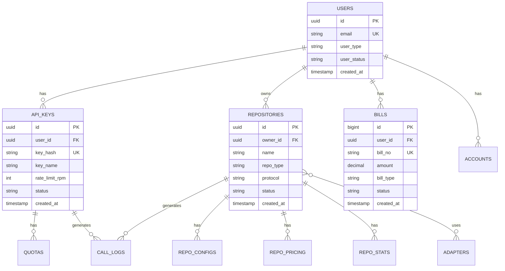
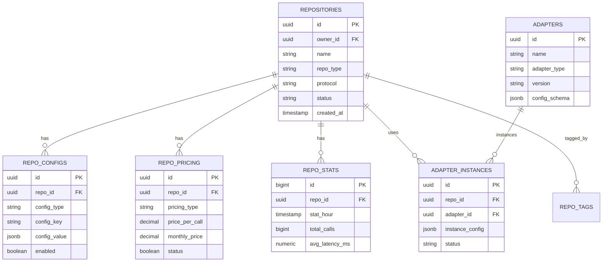

# 通用API服务平台 - 数据库设计文档

## 文档信息

| 属性 | 内容 |
|------|------|
| **文档编号** | DB-PLATFORM-2026-001 |
| **版本** | V1.1 |
| **日期** | 2026-04-16 |

---

## 1. 数据库概述

### 1.1 设计原则

| 原则 | 说明 |
|------|------|
| **规范化** | 遵循3NF，减少数据冗余 |
| **可扩展** | 预留扩展字段，支持分库分表 |
| **高性能** | 合理索引，优化查询 |
| **安全性** | 敏感数据加密，行级权限 |

### 1.2 技术选型

| 数据库 | 用途 | 说明 |
|--------|------|------|
| **PostgreSQL** | 主数据库 | 用户、仓库、订单等核心数据 |
| **Redis** | 缓存 | 认证信息、配额缓存、会话 |
| **ClickHouse** | 分析库 | 调用日志、统计分析 |
| **MongoDB** | 文档存储 | 仓库配置、日志详情 |

### 1.3 命名规范

| 类型 | 规范 | 示例 |
|------|------|------|
| 表名 | 小写下划线 | api_users |
| 字段名 | 小写下划线 | user_id |
| 主键 | id | id |
| 外键 | xxx_id | user_id |
| 索引 | idx_xxx | idx_user_email |
| 时间戳 | created_at | created_at |

---

## 2. ER图

### 2.1 核心实体关系



### 2.2 仓库相关实体



---

## 3. 表结构设计

### 3.1 用户相关表

#### 3.1.1 用户表 (users)

```sql
-- 用户表
CREATE TABLE users (
    id UUID PRIMARY KEY DEFAULT gen_random_uuid(),
    
    -- 基本信息
    email VARCHAR(255) UNIQUE NOT NULL,
    password_hash VARCHAR(255),
    phone VARCHAR(20),
    
    -- 用户类型
    user_type VARCHAR(20) NOT NULL DEFAULT 'developer',  -- developer/owner/admin
    user_status VARCHAR(20) NOT NULL DEFAULT 'active',    -- active/disabled
    
    -- OAuth信息
    oauth_provider VARCHAR(50),
    oauth_id VARCHAR(255),
    
    -- 认证信息
    email_verified BOOLEAN DEFAULT FALSE,
    phone_verified BOOLEAN DEFAULT FALSE,
    
    -- 会员信息
    vip_level INT DEFAULT 0,
    vip_expire_at TIMESTAMP,
    
    -- 审计字段
    created_at TIMESTAMP DEFAULT NOW(),
    updated_at TIMESTAMP DEFAULT NOW(),
    last_login_at TIMESTAMP,
    last_login_ip INET,
    
    -- 扩展字段
    extra JSONB DEFAULT '{}'::jsonb
);

-- 索引
CREATE INDEX idx_users_email ON users(email);
CREATE INDEX idx_users_type ON users(user_type);
CREATE INDEX idx_users_status ON users(user_status);
CREATE INDEX idx_users_oauth ON users(oauth_provider, oauth_id);

COMMENT ON TABLE users IS '用户表：存储开发者、仓库所有者、管理员信息';
```

#### 3.1.2 用户配置表 (user_profiles)

```sql
-- 用户配置表
CREATE TABLE user_profiles (
    id UUID PRIMARY KEY DEFAULT gen_random_uuid(),
    user_id UUID NOT NULL REFERENCES users(id) ON DELETE CASCADE,
    
    -- 基本信息
    nickname VARCHAR(100),
    avatar_url VARCHAR(500),
    real_name VARCHAR(100),
    company VARCHAR(200),
    website VARCHAR(500),
    
    -- 联系信息
    contact_email VARCHAR(255),
    contact_phone VARCHAR(20),
    
    -- 计费信息
    billing_type VARCHAR(20) DEFAULT 'prepaid',  -- prepaid/postpaid
    credit_limit DECIMAL(10,2) DEFAULT 0,
    
    -- 安全设置
    mfa_enabled BOOLEAN DEFAULT FALSE,
    login_notify BOOLEAN DEFAULT TRUE,
    
    -- 审计字段
    created_at TIMESTAMP DEFAULT NOW(),
    updated_at TIMESTAMP DEFAULT NOW()
);

CREATE INDEX idx_profiles_user ON user_profiles(user_id);

COMMENT ON TABLE user_profiles IS '用户配置表：存储用户扩展信息和配置';
```

### 3.2 API Key表

#### 3.2.1 API Key主表 (api_keys)

```sql
-- API Key表
CREATE TABLE api_keys (
    id UUID PRIMARY KEY DEFAULT gen_random_uuid(),
    
    -- 关联信息
    user_id UUID NOT NULL REFERENCES users(id) ON DELETE CASCADE,
    
    -- Key信息
    key_name VARCHAR(100) NOT NULL,
    key_prefix VARCHAR(10) NOT NULL,  -- sk_test_xxxxx 前缀
    key_hash VARCHAR(64) NOT NULL,    -- SHA256哈希存储
    secret_hash VARCHAR(128),        -- HMAC密钥哈希
    
    -- 认证配置
    auth_type VARCHAR(20) DEFAULT 'api_key',  -- api_key/hmac/jwt
    allowed_ips CIDR[],               -- IP白名单
    allowed_repos UUID[],             -- 允许访问的仓库
    denied_repos UUID[],              -- 禁止访问的仓库
    
    -- 限流配置
    rate_limit_rpm INT DEFAULT 1000,   -- 每分钟限制
    rate_limit_rph INT DEFAULT 10000,  -- 每小时限制
    daily_quota BIGINT,                -- 日配额（NULL表示无限制）
    monthly_quota BIGINT,              -- 月配额（NULL表示无限制）
    
    -- 状态
    status VARCHAR(20) DEFAULT 'active',  -- active/disabled/expired
    
    -- 有效期
    expires_at TIMESTAMP,              -- 过期时间（NULL表示永不过期）
    
    -- 统计
    total_calls BIGINT DEFAULT 0,
    last_call_at TIMESTAMP,
    
    -- 审计字段
    created_at TIMESTAMP DEFAULT NOW(),
    updated_at TIMESTAMP DEFAULT NOW(),
    disabled_at TIMESTAMP
);

-- 索引
CREATE INDEX idx_keys_user ON api_keys(user_id);
CREATE INDEX idx_keys_prefix ON api_keys(key_prefix);
CREATE INDEX idx_keys_status ON api_keys(status);
CREATE UNIQUE INDEX idx_keys_key_hash ON api_keys(key_hash);

COMMENT ON TABLE api_keys IS 'API Key表：存储用户的API密钥信息';
```

#### 3.2.2 Key使用记录表 (key_usage_logs)

```sql
-- Key使用记录表
CREATE TABLE key_usage_logs (
    id BIGSERIAL PRIMARY KEY,
    
    key_id UUID NOT NULL REFERENCES api_keys(id),
    user_id UUID NOT NULL REFERENCES users(id),
    
    -- 调用信息
    repo_id UUID,
    endpoint VARCHAR(255),
    method VARCHAR(10),
    status_code INT,
    latency_ms INT,
    
    -- 计费信息
    tokens_used INT,
    cost DECIMAL(10,6),
    
    -- 请求信息
    ip_address INET,
    user_agent TEXT,
    
    -- 时间
    created_at TIMESTAMP DEFAULT NOW()
);

-- 索引（用于统计查询）
CREATE INDEX idx_key_logs_key_time ON key_usage_logs(key_id, created_at DESC);
CREATE INDEX idx_key_logs_user_time ON key_usage_logs(user_id, created_at DESC);
CREATE INDEX idx_key_logs_repo_time ON key_usage_logs(repo_id, created_at DESC);

COMMENT ON TABLE key_usage_logs IS 'Key使用记录表：记录每次API调用，用于统计和计费';
```

### 3.3 仓库相关表

#### 3.3.1 仓库主表 (repositories)

```sql
-- 仓库表
CREATE TABLE repositories (
    id UUID PRIMARY KEY DEFAULT gen_random_uuid(),
    
    -- 所有者
    owner_id UUID NOT NULL REFERENCES users(id),
    owner_type VARCHAR(20) NOT NULL,  -- internal/external
    
    -- 基本信息
    name VARCHAR(100) NOT NULL,
    slug VARCHAR(100) NOT NULL,       -- URL友好名称
    display_name VARCHAR(200),
    description TEXT,
    logo_url VARCHAR(500),
    
    -- 仓库类型
    repo_type VARCHAR(50) NOT NULL,  -- psychology/stock/ai/translation
    protocol VARCHAR(20) NOT NULL,   -- http/grpc/websocket
    adapter_id VARCHAR(50),          -- 适配器ID
    
    -- 接入信息
    endpoint_url VARCHAR(500),       -- 仓库API地址
    health_check_url VARCHAR(500),    -- 健康检查地址
    api_docs_url VARCHAR(500),       -- API文档地址
    
    -- 配置
    config JSONB DEFAULT '{}'::jsonb,
    
    -- 状态
    status VARCHAR(20) DEFAULT 'pending',  -- pending/approved/rejected/online/offline
    rejection_reason TEXT,
    
    -- SLA配置
    sla_uptime DECIMAL(5,2),          -- SLA可用性目标
    sla_latency_p99 INT,             -- SLA P99延迟目标（毫秒）
    
    -- 统计
    total_calls BIGINT DEFAULT 0,
    active_keys INT DEFAULT 0,
    avg_latency_ms INT,
    success_rate DECIMAL(5,2),
    
    -- 审核信息
    approved_at TIMESTAMP,
    approved_by UUID,
    reviewed_by UUID,
    
    -- 上线信息
    online_at TIMESTAMP,
    offline_at TIMESTAMP,
    
    -- 审计字段
    created_at TIMESTAMP DEFAULT NOW(),
    updated_at TIMESTAMP DEFAULT NOW()
);

-- 索引
CREATE INDEX idx_repos_owner ON repositories(owner_id);
CREATE INDEX idx_repos_status ON repositories(status);
CREATE INDEX idx_repos_type ON repositories(repo_type);
CREATE INDEX idx_repos_slug ON repositories(slug);
CREATE UNIQUE INDEX idx_repos_name_owner ON repositories(owner_id, name);

COMMENT ON TABLE repositories IS '仓库表：存储API仓库信息';
```

#### 3.3.2 仓库配置表 (repo_configs)

```sql
-- 仓库配置表
CREATE TABLE repo_configs (
    id UUID PRIMARY KEY DEFAULT gen_random_uuid(),
    repo_id UUID NOT NULL REFERENCES repositories(id) ON DELETE CASCADE,
    
    -- 配置类型
    config_type VARCHAR(50) NOT NULL,  -- route/auth/rate_limit/transform
    
    -- 配置数据
    config_key VARCHAR(100) NOT NULL,
    config_value JSONB NOT NULL,
    config_order INT DEFAULT 0,
    
    -- 状态
    enabled BOOLEAN DEFAULT TRUE,
    
    -- 审计字段
    created_at TIMESTAMP DEFAULT NOW(),
    updated_at TIMESTAMP DEFAULT NOW(),
    
    UNIQUE(repo_id, config_type, config_key)
);

CREATE INDEX idx_repo_configs_repo ON repo_configs(repo_id);
CREATE INDEX idx_repo_configs_type ON repo_configs(config_type);

COMMENT ON TABLE repo_configs IS '仓库配置表：存储仓库的详细配置';
```

#### 3.3.3 仓库定价表 (repo_pricing)

```sql
-- 仓库定价表
CREATE TABLE repo_pricing (
    id UUID PRIMARY KEY DEFAULT gen_random_uuid(),
    repo_id UUID NOT NULL REFERENCES repositories(id) ON DELETE CASCADE,
    
    -- 定价模式
    pricing_type VARCHAR(20) NOT NULL,  -- per_call/token/流量/subscription
    
    -- 价格
    price_per_call DECIMAL(10,6),       -- 单次价格
    price_per_token DECIMAL(10,8),      -- 单Token价格
    price_per_mb DECIMAL(10,6),         -- 单MB价格
    monthly_price DECIMAL(10,2),        -- 月订阅价格
    yearly_price DECIMAL(10,2),         -- 年订阅价格
    
    -- 免费额度
    free_calls INT DEFAULT 0,          -- 免费调用次数
    free_tokens INT DEFAULT 0,          -- 免费Token数
    free_quota_days INT DEFAULT 0,      -- 免费试用期天数
    
    -- 套餐
    packages JSONB DEFAULT '[]'::jsonb,
    -- 示例: [{"name": "基础版", "calls": 10000, "price": 99}, ...]
    
    -- 状态
    status VARCHAR(20) DEFAULT 'active',
    
    -- 审计字段
    created_at TIMESTAMP DEFAULT NOW(),
    updated_at TIMESTAMP DEFAULT NOW()
);

CREATE INDEX idx_repo_pricing_repo ON repo_pricing(repo_id);

COMMENT ON TABLE repo_pricing IS '仓库定价表：存储仓库的计费策略';
```

#### 3.3.4 仓库统计表 (repo_stats)

```sql
-- 仓库统计表（按小时聚合）
CREATE TABLE repo_stats (
    id BIGSERIAL PRIMARY KEY,
    repo_id UUID NOT NULL REFERENCES repositories(id),
    
    -- 时间维度
    stat_hour TIMESTAMP NOT NULL,
    
    -- 调用统计
    total_calls BIGINT DEFAULT 0,
    success_calls BIGINT DEFAULT 0,
    failed_calls BIGINT DEFAULT 0,
    
    -- 性能统计
    avg_latency_ms NUMERIC(10,2),
    p50_latency_ms INT,
    p90_latency_ms INT,
    p99_latency_ms INT,
    max_latency_ms INT,
    
    -- 流量统计
    total_bytes BIGINT DEFAULT 0,
    total_tokens BIGINT DEFAULT 0,
    
    -- 成本统计
    total_cost DECIMAL(12,6) DEFAULT 0,
    
    -- 唯一调用方
    unique_keys INT DEFAULT 0,
    unique_users INT DEFAULT 0,
    
    UNIQUE(repo_id, stat_hour)
);

CREATE INDEX idx_repo_stats_repo_time ON repo_stats(repo_id, stat_hour DESC);

COMMENT ON TABLE repo_stats IS '仓库统计表：按小时聚合的仓库调用统计数据';
```

### 3.4 适配器表

#### 3.4.1 适配器表 (adapters)

```sql
-- 适配器表
CREATE TABLE adapters (
    id UUID PRIMARY KEY DEFAULT gen_random_uuid(),
    
    -- 适配器信息
    name VARCHAR(100) NOT NULL,
    adapter_type VARCHAR(50) NOT NULL,  -- http/grpc/websocket/graphql/soap
    
    -- 版本
    version VARCHAR(20) NOT NULL,
    
    -- 配置
    config_schema JSONB NOT NULL,       -- 配置JSON Schema
    default_config JSONB DEFAULT '{}'::jsonb,
    
    -- 能力
    capabilities JSONB DEFAULT '{}'::jsonb,
    -- 示例: {"auth": ["api_key", "oauth"], "transform": true, "websocket": false}
    
    -- 状态
    status VARCHAR(20) DEFAULT 'active',  -- active/deprecated
    
    -- 统计
    total_repos INT DEFAULT 0,          -- 使用此适配器的仓库数
    
    -- 审计字段
    created_at TIMESTAMP DEFAULT NOW(),
    updated_at TIMESTAMP DEFAULT NOW()
);

CREATE INDEX idx_adapters_type ON adapters(adapter_type);
CREATE INDEX idx_adapters_status ON adapters(status);

COMMENT ON TABLE adapters IS '适配器表：存储支持的适配器类型';
```

### 3.5 账务相关表

#### 3.5.1 账户表 (accounts)

```sql
-- 账户表
CREATE TABLE accounts (
    id UUID PRIMARY KEY DEFAULT gen_random_uuid(),
    user_id UUID NOT NULL REFERENCES users(id) ON DELETE CASCADE,
    
    -- 账户类型
    account_type VARCHAR(20) NOT NULL,  -- balance/bonus/voucher
    
    -- 余额
    balance DECIMAL(12,2) DEFAULT 0,
    frozen_balance DECIMAL(12,2) DEFAULT 0,  -- 冻结金额
    
    -- 统计
    total_recharge DECIMAL(12,2) DEFAULT 0,   -- 累计充值
    total_consume DECIMAL(12,2) DEFAULT 0,    -- 累计消费
    
    -- 审计字段
    created_at TIMESTAMP DEFAULT NOW(),
    updated_at TIMESTAMP DEFAULT NOW(),
    
    UNIQUE(user_id, account_type)
);

CREATE INDEX idx_accounts_user ON accounts(user_id);

COMMENT ON TABLE accounts IS '账户表：存储用户账户余额信息';
```

#### 3.5.2 账单表 (bills)

```sql
-- 账单表
CREATE TABLE bills (
    id BIGSERIAL PRIMARY KEY,
    user_id UUID NOT NULL REFERENCES users(id),
    
    -- 账单标识
    bill_no VARCHAR(50) UNIQUE NOT NULL,
    bill_type VARCHAR(20) NOT NULL,  -- recharge/consume/refund/bonus
    
    -- 金额
    amount DECIMAL(12,2) NOT NULL,    -- 变动金额（正负）
    balance_before DECIMAL(12,2) NOT NULL,
    balance_after DECIMAL(12,2) NOT NULL,
    
    -- 来源
    source_type VARCHAR(20),          -- api_call/refund/admin/manual
    source_id VARCHAR(50),            -- 关联的调用记录ID等
    
    -- 描述
    description TEXT,
    remark TEXT,
    
    -- 状态
    status VARCHAR(20) DEFAULT 'completed',  -- pending/completed/failed/cancelled
    
    -- 支付信息
    payment_method VARCHAR(20),
    payment_channel VARCHAR(50),
    transaction_id VARCHAR(100),
    
    -- 审计字段
    created_at TIMESTAMP DEFAULT NOW(),
    completed_at TIMESTAMP
);

CREATE INDEX idx_bills_user_time ON bills(user_id, created_at DESC);
CREATE INDEX idx_bills_type ON bills(bill_type);
CREATE INDEX idx_bills_status ON bills(status);

COMMENT ON TABLE bills IS '账单表：记录用户账户变动流水';
```

#### 3.5.3 配额表 (quotas)

```sql
-- 配额表
CREATE TABLE quotas (
    id BIGSERIAL PRIMARY KEY,
    
    user_id UUID NOT NULL REFERENCES users(id),
    key_id UUID REFERENCES api_keys(id),
    repo_id UUID REFERENCES repositories(id),
    
    -- 配额类型
    quota_type VARCHAR(20) NOT NULL,  -- rpm/rph/daily/monthly
    
    -- 配额限制
    quota_limit BIGINT NOT NULL,
    quota_used BIGINT DEFAULT 0,
    quota_remaining BIGINT,
    
    -- 重置周期
    reset_type VARCHAR(20) NOT NULL,  -- never/hourly/daily/monthly
    reset_at TIMESTAMP,               -- 下次重置时间
    
    -- 审计字段
    created_at TIMESTAMP DEFAULT NOW(),
    updated_at TIMESTAMP DEFAULT NOW(),
    
    UNIQUE(user_id, key_id, repo_id, quota_type)
);

CREATE INDEX idx_quotas_user ON quotas(user_id);
CREATE INDEX idx_quotas_reset ON quotas(reset_at) WHERE reset_type != 'never';

COMMENT ON TABLE quotas IS '配额表：记录用户API调用配额使用情况';
```

### 3.6 日志表

#### 3.6.1 调用日志表 (call_logs)

```sql
-- 调用日志表（ClickHouse优化）
CREATE TABLE call_logs (
    id BIGINT PRIMARY KEY,
    
    -- 用户信息
    user_id UUID NOT NULL,
    user_email VARCHAR(255),
    
    -- Key信息
    key_id UUID,
    key_prefix VARCHAR(10),
    
    -- 仓库信息
    repo_id UUID,
    repo_name VARCHAR(100),
    repo_type VARCHAR(50),
    
    -- 请求信息
    request_id VARCHAR(50) NOT NULL,  -- 追踪ID
    trace_id VARCHAR(50),
    
    endpoint VARCHAR(255) NOT NULL,
    method VARCHAR(10) NOT NULL,
    path VARCHAR(500),
    query_params JSONB,
    request_headers JSONB,
    request_body JSONB,
    
    -- 响应信息
    status_code INT NOT NULL,
    response_headers JSONB,
    response_body JSONB,
    response_size BIGINT,
    
    -- 性能信息
    latency_ms INT NOT NULL,
    upstream_latency_ms INT,
    
    -- 计费信息
    tokens_used INT,
    cost DECIMAL(10,6),
    
    -- 客户端信息
    ip_address VARCHAR(50),
    user_agent TEXT,
    device_type VARCHAR(20),
    location VARCHAR(100),
    
    -- 时间
    created_at TIMESTAMP NOT NULL
) PARTITION BY toYYYYMM(created_at);

CREATE INDEX idx_call_logs_user_time ON call_logs(user_id, created_at DESC);
CREATE INDEX idx_call_logs_repo_time ON call_logs(repo_id, created_at DESC);
CREATE INDEX idx_call_logs_request ON call_logs(request_id);

COMMENT ON TABLE call_logs IS '调用日志表：记录所有API调用详情';
```

### 3.7 审计日志表

#### 3.7.1 审计日志表 (audit_logs)

```sql
-- 审计日志表
CREATE TABLE audit_logs (
    id BIGSERIAL PRIMARY KEY,
    
    -- 操作者
    user_id UUID,
    user_email VARCHAR(255),
    operator_type VARCHAR(20),  -- user/system/admin
    
    -- 操作信息
    action VARCHAR(100) NOT NULL,
    resource_type VARCHAR(50) NOT NULL,
    resource_id VARCHAR(50),
    
    -- 变更内容
    before_value JSONB,
    after_value JSONB,
    
    -- 请求信息
    request_id VARCHAR(50),
    ip_address INET,
    user_agent TEXT,
    
    -- 结果
    status VARCHAR(20) DEFAULT 'success',  -- success/failed
    error_message TEXT,
    
    -- 时间
    created_at TIMESTAMP DEFAULT NOW()
);

CREATE INDEX idx_audit_user ON audit_logs(user_id);
CREATE INDEX idx_audit_action ON audit_logs(action);
CREATE INDEX idx_audit_resource ON audit_logs(resource_type, resource_id);
CREATE INDEX idx_audit_time ON audit_logs(created_at);

COMMENT ON TABLE audit_logs IS '审计日志表：记录用户和管理员的关键操作';
```

---

## 4. 索引设计

### 4.1 索引汇总

| 表名 | 索引名 | 字段 | 类型 | 用途 |
|------|--------|------|------|------|
| users | idx_users_email | email | BTree | 登录查询 |
| users | idx_users_type | user_type | BTree | 用户分类 |
| api_keys | idx_keys_user | user_id | BTree | Key查询 |
| api_keys | idx_keys_prefix | key_prefix | BTree | Key前缀查询 |
| api_keys | idx_keys_hash | key_hash | Hash | Key认证 |
| repositories | idx_repos_owner | owner_id | BTree | 仓库查询 |
| repositories | idx_repos_status | status | BTree | 状态查询 |
| bills | idx_bills_user_time | user_id, created_at | BTree | 账单查询 |
| call_logs | idx_call_logs_user | user_id, created_at | BTree | 日志查询 |
| call_logs | idx_call_logs_repo | repo_id, created_at | BTree | 仓库统计 |

### 4.2 复合索引

| 索引名 | 表 | 字段 | 顺序 | 用途 |
|--------|----|------|------|------|
| idx_keys_user_active | api_keys | user_id, status | ASC, ASC | 用户有效Key |
| idx_repos_owner_status | repositories | owner_id, status | ASC, ASC | 仓库列表 |
| idx_bills_user_type_time | bills | user_id, bill_type, created_at | ASC, ASC, DESC | 账单明细 |
| idx_call_logs_repo_hour | call_logs | repo_id, stat_hour | ASC, DESC | 仓库统计 |

---

## 5. 分库分表策略

### 5.1 分片策略

| 数据类型 | 分片策略 | 字段 |
|----------|----------|------|
| **用户数据** | 用户ID哈希 | user_id |
| **调用日志** | 时间分区 | created_at |
| **账单数据** | 用户ID哈希 | user_id |
| **仓库数据** | 仓库ID哈希 | repo_id |

### 5.2 冷热分离

| 数据 | 存储 | 保留时间 |
|------|------|----------|
| 最近30天日志 | PostgreSQL | 热数据 |
| 30-180天日志 | ClickHouse | 温数据 |
| 180天以上日志 | 对象存储 | 冷数据 |

---

## 6. 安全设计

### 6.1 敏感数据加密

```sql
-- 密码加密存储（bcrypt）
password_hash VARCHAR(255) NOT NULL

-- API Key只存储哈希
key_hash VARCHAR(64) NOT NULL  -- SHA256

-- HMAC密钥加密存储
secret_encrypted VARCHAR(512)  -- AES加密
```

### 6.2 行级安全

```sql
-- 用户只能查看自己的数据
CREATE POLICY user_data_policy ON users
    FOR ALL
    USING (id = current_user_id());

-- API Key行级权限
CREATE POLICY key_access_policy ON api_keys
    FOR ALL
    USING (user_id = current_user_id());
```

---

## 7. 附录

### 7.1 字段类型说明

| 类型 | 说明 | 示例 |
|------|------|------|
| UUID | 通用唯一标识符 | 550e8400-e29b-41d4-a716-446655440000 |
| JSONB | JSON二进制 | {"key": "value"} |
| INET | IP地址 | 192.168.1.1 |
| CIDR | 网络段 | 192.168.0.0/16 |
| DECIMAL | 定点小数 | 99.99 |
| BIGSERIAL | 大整数自增 | 123456789 |

### 7.2 状态值定义

| 表 | 字段 | 值 | 说明 |
|----|------|-----|------|
| users | user_status | active/disabled | 用户状态 |
| users | user_type | developer/owner/admin | 用户类型 |
| api_keys | status | active/disabled/expired | Key状态 |
| repositories | status | pending/approved/rejected/online/offline | 仓库状态 |
| bills | status | pending/completed/failed/cancelled | 账单状态 |
| audit_logs | status | success/failed | 操作状态 |

### 7.3 图表规范参考

本文档中的ER图采用 **Mermaid** 语法绘制，与标准图表规范文档（28_通用API服务平台图表规范.md）保持一致。
