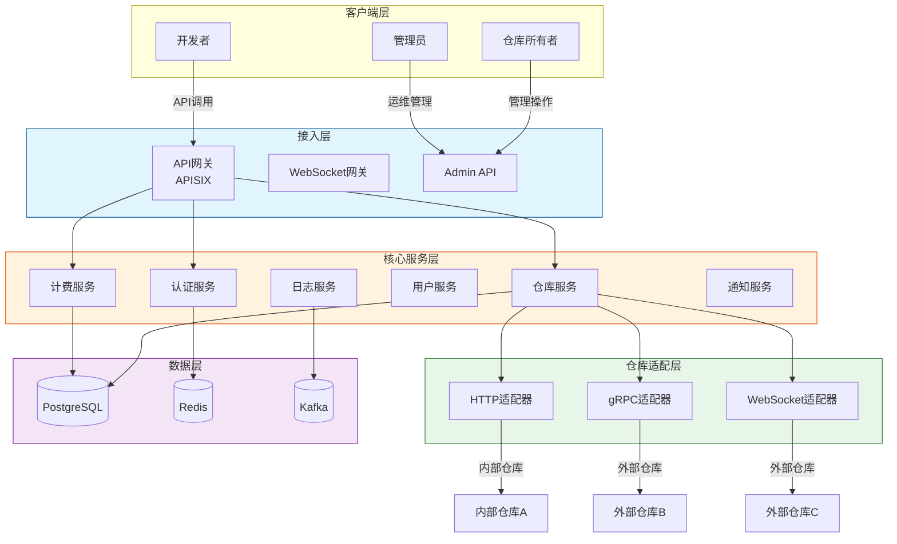
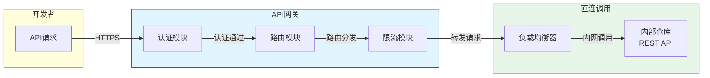
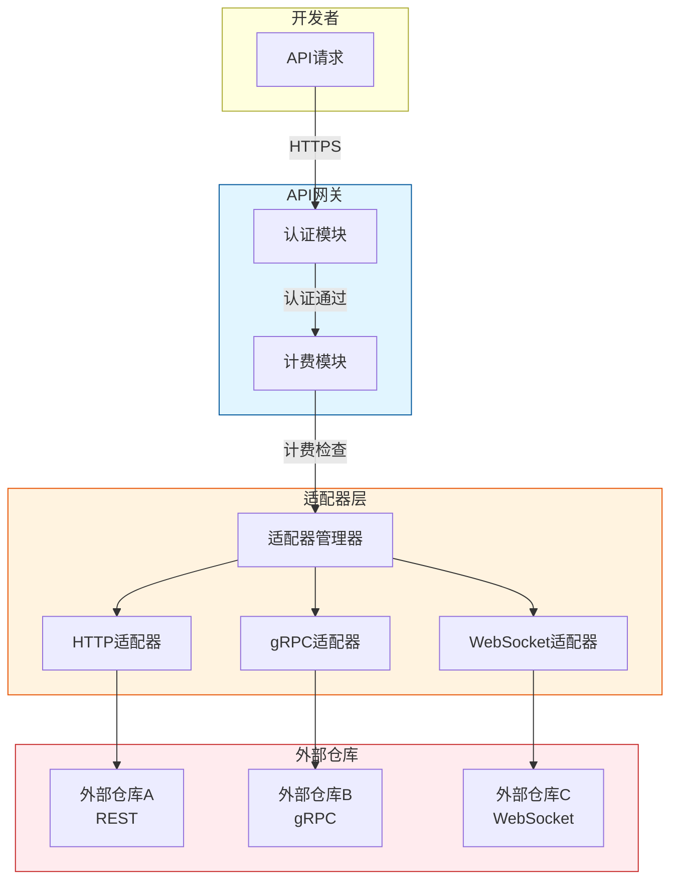
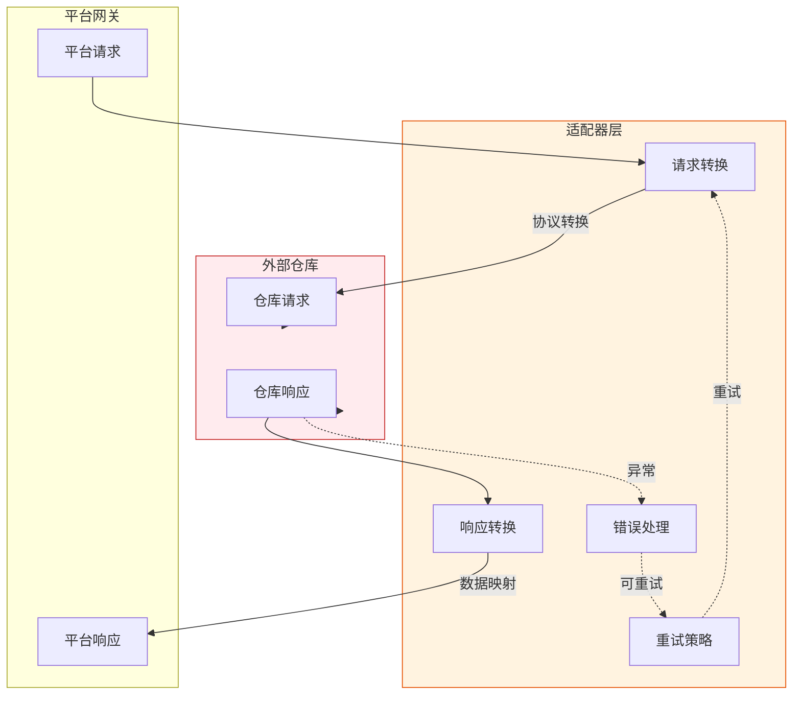
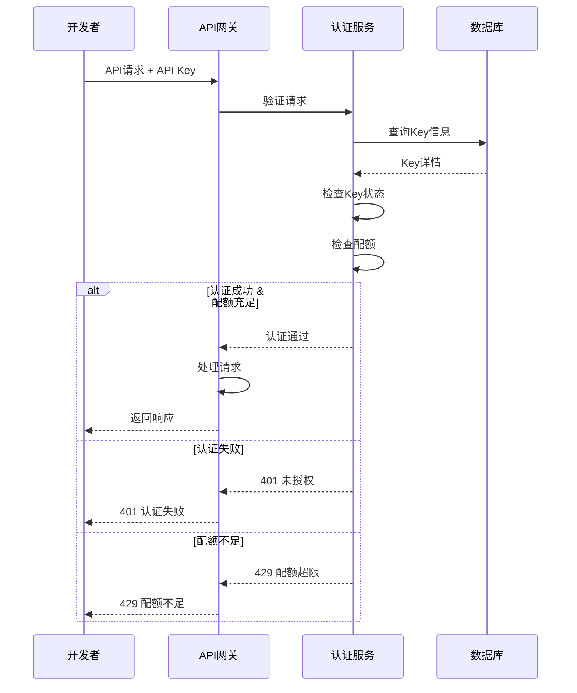
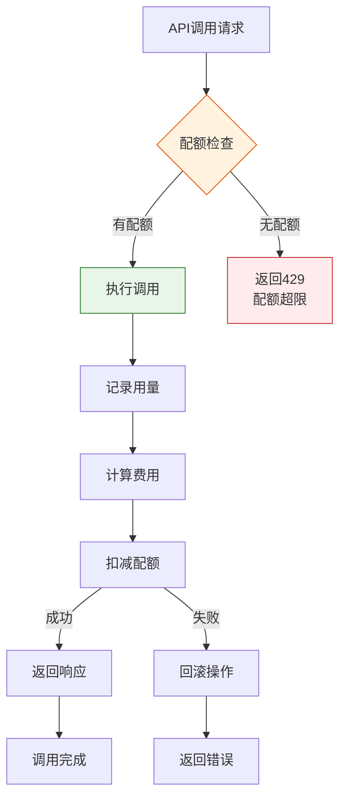
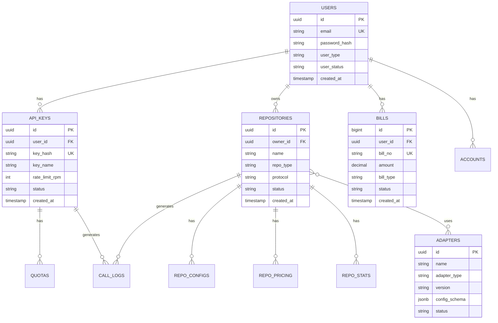
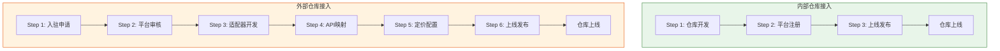
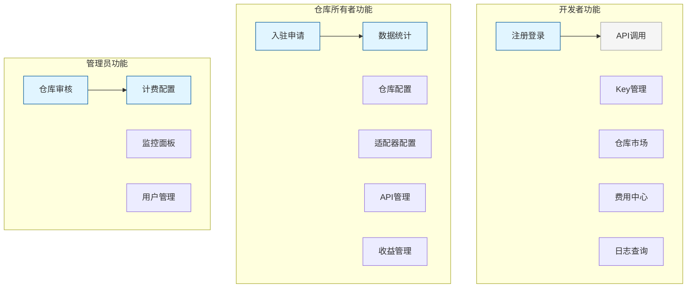
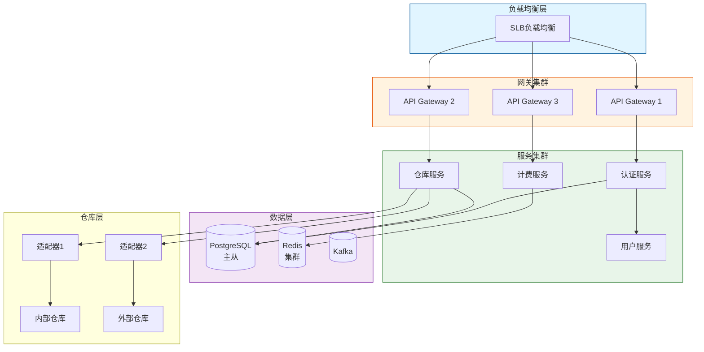

# 通用API服务平台 - 图表规范

## 文档信息

| 属性 | 内容 |
|------|------|
| **文档编号** | DIAGRAM-PLATFORM-2026-001 |
| **版本** | V1.0 |
| **日期** | 2026-04-16 |

---

## 1. 图表规范概述

### 1.1 图表工具选择

本项目采用 **Mermaid** 作为标准图表绘制工具，原因如下：

| 优势 | 说明 |
|------|------|
| **广泛支持** | GitHub、GitLab、VS Code、Notion等主流平台原生支持 |
| **文本编辑** | 纯文本格式，便于版本控制和协作 |
| **实时预览** | 大多数Markdown编辑器支持实时渲染 |
| **丰富类型** | 支持流程图、时序图、类图、ER图等 |

### 1.2 Mermaid图表类型对照表

| 图表类型 | Mermaid语法 | 适用场景 |
|----------|------------|----------|
| **流程图** | `graph TD/BT/LR/RL` | 业务流程、数据流向 |
| **时序图** | `sequenceDiagram` | API调用时序、交互流程 |
| **类图** | `classDiagram` | 数据模型、接口定义 |
| **ER图** | `erDiagram` | 数据库实体关系 |
| **状态图** | `stateDiagram` | 状态流转、生命周期 |
| **甘特图** | `gantt` | 项目计划、里程碑 |

---

## 2. 标准图表模板

### 2.1 平台整体架构图



### 2.2 内部仓库接入架构图



### 2.3 外部仓库接入架构图



### 2.4 适配器架构图



### 2.5 统一认证流程图



### 2.6 计费流程图



### 2.7 数据库ER图



### 2.8 仓库接入流程图



### 2.9 客户端需求矩阵图



### 2.10 部署架构图



---

## 3. 图表渲染环境配置

### 3.1 VS Code 配置

在 `.vscode/settings.json` 中添加：

```json
{
  "mermaid.diagrams": [
    "flowchart",
    "sequence",
    "class",
    "state",
    "er",
    "gantt"
  ],
  "markdown.mermaid.enable": true
}
```

安装扩展：**Markdown Preview Mermaid Support**

### 3.2 GitHub 配置

GitHub 原生支持 Mermaid，无需额外配置。

### 3.3 独立渲染HTML

如需生成独立图片，可使用以下方式：

```html
<!DOCTYPE html>
<html>
<head>
    <script src="https://cdn.jsdelivr.net/npm/mermaid@10/dist/mermaid.min.js"></script>
</head>
<body>
    <div class="mermaid">
        graph TD
        A[Start] --> B[End]
    </div>
    <script>mermaid.initialize({startOnLoad:true});</script>
</body>
</html>
```

---

## 4. 图表配色规范

### 4.1 标准化配色方案

| 用途 | 填充色 | 边框色 | 示例 |
|------|--------|--------|------|
| **接入层** | `#e1f5ff` | `#01579b` | API网关 |
| **核心服务** | `#fff3e0` | `#e65100` | 业务服务 |
| **适配器层** | `#e8f5e9` | `#2e7d32` | 协议转换 |
| **数据层** | `#f3e5f5` | `#7b1fa2` | 数据库 |
| **客户端** | `#fce4ec` | `#c2185b` | 用户端 |
| **外部依赖** | `#ffebee` | `#c62828` | 外部服务 |

### 4.2 状态配色

| 状态 | 填充色 | 边框色 |
|------|--------|--------|
| **成功** | `#c8e6c9` | `#388e3c` |
| **警告** | `#fff9c4` | `#f9a825` |
| **错误** | `#ffcdd2` | `#d32f2f` |
| **信息** | `#bbdefb` | `#1976d2` |

---

## 5. 附录

### 5.1 Mermaid 语法速查

```mermaid
%% 流程图方向
graph TD/BT/LR/RL

%% 节点形状
A[矩形]
B(圆角矩形)
C([体育场形])
D[[子程序]]
E((圆形))
F{菱形}

%% 连接线
A --> B    %% 箭头实线
A --- B    %% 无箭头实线
A -.-> B   %% 箭头虚线
A -.-> B   %% 无箭头虚线
A ==> B    %% 加粗箭头

%% 样式
style A fill:#f9f,stroke:#333,stroke-width:4px
class A need
```

### 5.2 参考资源

- [Mermaid 官方文档](https://mermaid.js.org/)
- [Mermaid Live Editor](https://mermaid.live/)
- [GitHub Mermaid 支持](https://github.blog/2022-02-14-include-diagrams-markdown-files-mermaid/)
