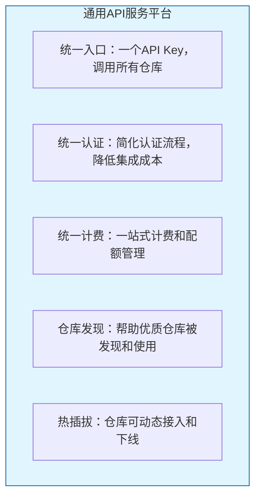
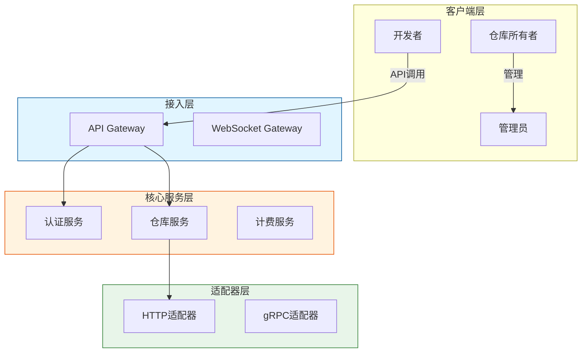

# 通用API服务平台 - 新人上手指南

## 文档信息

| 属性 | 内容 |
|------|------|
| **文档编号** | GUIDE-PLATFORM-2026-001 |
| **版本** | V1.1 |
| **日期** | 2026-04-17 |
| **目标读者** | 新加入项目的开发人员 |

---

## 1. 快速导航

### 1.1 文档体系

| 文档 | 说明 | 阅读优先级 |
|------|------|-----------|
| 新人上手指南（本文档） | 项目全景介绍 | P0 |
| 快速开始教程 | 30分钟上手 | P0 |
| 需求规格说明书 | 功能需求定义 | P1 |
| 实施方案 | 技术架构设计 | P1 |
| 接口设计文档 | API接口规范 | P1 |
| 数据库设计文档 | 数据模型定义 | P2 |
| SDK使用手册 | 客户端集成 | P1 |

### 1.2 核心概念速查

| 术语 | 说明 | 一句话理解 |
|------|------|-----------|
| **平台** | 通用API服务平台 | API聚合中转站 |
| **仓库** | 可接入平台的API服务单元 | 一个仓库=一个API服务 |
| **内部仓库** | 平台自建的API服务 | 官方服务 |
| **外部仓库** | 第三方接入的API服务 | 第三方服务 |
| **适配器** | 连接平台与仓库的协议转换组件 | 翻译官 |

---

## 2. 项目全景

### 2.1 项目背景

通用API服务平台旨在解决以下痛点：

| 痛点 | 现状 | 我们的解决方案 |
|------|------|---------------|
| **碎片化** | 开发者需要在多个平台注册、管理多个API Key | 一个API Key，调用所有仓库 |
| **标准不统一** | 各API服务接口规范不一致，集成成本高 | 统一认证、统一计费、统一日志 |
| **认证复杂** | 每个平台都有自己的认证方式 | API Key + HMAC签名，简化认证 |
| **计费混乱** | 缺乏统一的计费和配额管理 | 一站式计费和配额管理 |
| **仓库分散** | 好的API仓库难以被发现和集成 | 仓库市场，发现优质服务 |

### 2.2 核心价值



### 2.3 技术架构



---

## 3. 快速开始（30分钟上手）

### 3.1 第一步：获取API Key

1. 注册开发者账号
2. 登录开发者控制台
3. 创建API Key
4. 获取Key和Secret

### 3.2 第二步：安装SDK

**Python SDK**
```bash
pip install api-platform-sdk
```

**JavaScript/TypeScript SDK**
```bash
npm install api-platform-sdk
```

### 3.3 第三步：发送第一个请求

**Python示例**
```python
from api_platform import Client

# 初始化客户端
client = Client(
    api_key="your_api_key",
    api_secret="your_api_secret",
    base_url="https://api.platform.com/v1"
)

# 调用心理问答API
response = client.chat(
    repo="psychology",
    message="我最近失眠怎么办？"
)

print(response)
```

**JavaScript示例**
```javascript
import { Client } from 'api-platform-sdk';

// 初始化客户端
const client = new Client({
  apiKey: 'your_api_key',
  apiSecret: 'your_api_secret',
  baseUrl: 'https://api.platform.com/v1'
});

// 调用心理问答API
const response = await client.chat({
  repo: 'psychology',
  message: '我最近失眠怎么办？'
});

console.log(response);
```

---

## 4. 角色与权限

### 4.1 用户类型

| 角色 | 说明 | 主要操作 |
|------|------|----------|
| **开发者** | API使用者 | 注册、创建Key、调用API、管理费用 |
| **仓库所有者** | API提供者 | 入驻、创建仓库、配置定价、查看收益 |
| **管理员** | 平台运营 | 审核仓库、配置系统、查看运营数据 |

### 4.2 客户端需求

| 用户类型 | 控制台需求 | API调用客户端需求 |
|----------|-----------|------------------|
| 开发者 | 需要（Key管理、费用中心） | 不需要（直接HTTP/SDK调用） |
| 仓库所有者 | 需要（仓库管理、收益管理） | 不需要 |
| 管理员 | 需要（平台运营） | 不需要 |

---

## 5. 技术栈全景

### 5.1 技术选型

| 层级 | 技术 | 说明 |
|------|------|------|
| **网关** | APISIX | 高性能API网关 |
| **后端** | Go / Java / Node.js | 微服务开发 |
| **数据库** | PostgreSQL + Redis | 主数据 + 缓存 |
| **消息队列** | Kafka / RabbitMQ | 异步处理 |
| **监控系统** | Prometheus + Grafana | 监控告警 |
| **日志系统** | ELK Stack | 日志收集分析 |
| **前端** | React + TypeScript | 管理控制台 |

### 5.2 目录结构

```
api-platform/
├── api-gateway/          # API网关配置
├── services/              # 核心服务
│   ├── auth/             # 认证服务
│   ├── repository/       # 仓库服务
│   ├── billing/          # 计费服务
│   └── user/             # 用户服务
├── adapters/             # 适配器
│   ├── http-adapter/     # HTTP适配器
│   └── grpc-adapter/     # gRPC适配器
├── console/              # 管理控制台
│   ├── developer/        # 开发者控制台
│   └── owner/            # 仓库所有者控制台
├── sdks/                 # 客户端SDK
│   ├── python/           # Python SDK
│   └── javascript/       # JavaScript SDK
└── docs/                 # 项目文档
```

---

## 6. 常见问题

### Q1: 如何调用API？

**方式一：SDK调用（推荐）**
```python
client = Client(api_key="xxx")
response = client.call("psychology", "/chat", {"message": "hi"})
```

**方式二：HTTP直接调用**
```bash
curl -X POST https://api.platform.com/v1/repositories/psychology/chat \
  -H "X-Access-Key: your_api_key" \
  -H "X-Signature: your_signature" \
  -H "Content-Type: application/json" \
  -d '{"message": "hi"}'
```

### Q2: 如何创建仓库？

1. 申请成为仓库所有者
2. 在控制台创建仓库
3. 配置仓库信息和定价
4. 提交审核
5. 审核通过后上线

### Q3: 计费是如何计算的？

支持多种计费模式：
- **按次计费**：每次调用扣减余额
- **Token计费**：按Token数量计费（AI模型）
- **流量计费**：按数据传输量计费
- **套餐计费**：包月/包年套餐

### Q4: 如何排查调用问题？

1. 检查API Key是否有效
2. 检查签名是否正确
3. 查看调用日志确认错误码
4. 参考错误码文档定位问题

---

## 7. 下一步

| 场景 | 推荐文档 |
|------|----------|
| 想快速体验 | 快速开始教程 |
| 想了解功能 | 需求规格说明书 |
| 想了解技术 | 实施方案 |
| 想集成SDK | SDK使用手册 |
| 想排查问题 | 故障排查手册 |

---

## 8. 联系方式

| 渠道 | 说明 |
|------|------|
| 内部Wiki | 项目文档和分享 |
| 技术交流群 | 实时技术讨论 |
| Issue系统 | Bug反馈和功能建议 |
| 代码Review | 代码规范和评审 |
