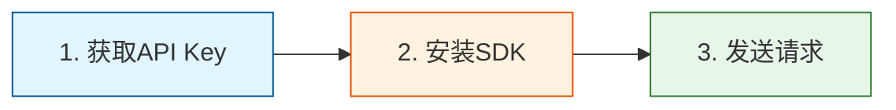

# 通用API服务平台 - 快速开始教程（增强版）

## 文档信息：

| 属性 | 内容 |
|------|------|
| **文档编号** | QUICKSTART-PLATFORM-2026-001 |
| **版本** | V1.2 |
| **日期** | 2026-04-17 |
| **预计完成时间** | 30分钟 |
| **更新说明** | 增加实用业务场景示例，完善错误处理 |

---

## 1. 概述

本教程将帮助您在30分钟内完成通用API服务平台的集成。无论您使用Python还是JavaScript，都能快速上手。教程包含完整的代码示例，覆盖常见业务场景。

### 1.1 前置要求

- 开发者账号
- API Key
- Python 3.8+ 或 Node.js 16+

### 1.2 三步集成法



---

## 2. 第一步：获取API Key

### 2.1 注册账号

1. 访问开发者控制台：https://console.platform.com
2. 点击"注册"按钮
3. 填写邮箱、密码
4. 验证邮箱

### 2.2 创建API Key

1. 登录开发者控制台
2. 进入"API Key管理"
3. 点击"创建Key"
4. 输入Key名称（建议：生产环境/测试环境）
5. 点击"确认"
6. **重要**：保存显示的Key和Secret

### 2.3 Key类型说明

| Key类型 | 说明 | 使用场景 |
|---------|------|----------|
| **测试Key** | sk_test_xxx | 开发测试，调用免费额度 |
| **生产Key** | sk_live_xxx | 正式环境，按量计费 |

---

## 3. 第二步：安装SDK

### 3.1 Python SDK

**安装**：

```bash
pip install api-platform-sdk
```

**验证安装**：

```python
import api_platform
print(api_platform.__version__)
```

### 3.2 JavaScript/TypeScript SDK

**安装**：

```bash
npm install api-platform-sdk
# 或
yarn add api-platform-sdk
# 或
pnpm add api-platform-sdk
```

**验证安装**：

```javascript
import { Client } from 'api-platform-sdk';
console.log(Client.version);
```

---

## 4. 第三步：发送请求

### 4.1 Python完整示例

```python
from api_platform import Client

# ============ 初始化客户端 ============
client = Client(
    api_key="sk_live_xxxxxxxxxxxx",
    api_secret="your_secret_here",
    base_url="https://api.platform.com/v1",  # 统一入口
    timeout=30,  # 超时时间（秒）
    max_retries=3  # 最大重试次数
)

# ============ 示例1：心理问答 ============
try:
    response = client.chat(
        repo="psychology",
        message="我最近总是失眠，有什么建议吗？",
        user_id="user_123"  # 可选：用户标识
    )
    print(f"回答：{response.answer}")
except Exception as e:
    print(f"调用失败：{e}")

# ============ 示例2：文本翻译 ============
try:
    response = client.translate(
        repo="translation",
        text="Hello, World!",
        source_lang="en",
        target_lang="zh"
    )
    print(f"翻译结果：{response.result}")
except Exception as e:
    print(f"调用失败：{e}")

# ============ 示例3：图像识别 ============
try:
    response = client.image(
        repo="vision",
        image_url="https://example.com/image.jpg",
        task="ocr"
    )
    print(f"识别结果：{response.text}")
except Exception as e:
    print(f"调用失败：{e}")
```

### 4.2 JavaScript完整示例

```javascript
import { Client } from 'api-platform-sdk';

// ============ 初始化客户端 ============
const client = new Client({
  apiKey: 'sk_live_xxxxxxxxxxxx',
  apiSecret: 'your_secret_here',
  baseUrl: 'https://api.platform.com/v1',  // 统一入口
  timeout: 30000,  // 超时时间（毫秒）
  maxRetries: 3    // 最大重试次数
});

// ============ 示例1：心理问答 ============
try {
  const response = await client.chat({
    repo: 'psychology',
    message: '我最近总是失眠，有什么建议吗？',
    userId: 'user_123'  // 可选：用户标识
  });
  console.log(`回答：${response.answer}`);
} catch (error) {
  console.error(`调用失败：${error.message}`);
}

// ============ 示例2：文本翻译 ============
try {
  const response = await client.translate({
    repo: 'translation',
    text: 'Hello, World!',
    sourceLang: 'en',
    targetLang: 'zh'
  });
  console.log(`翻译结果：${response.result}`);
} catch (error) {
  console.error(`调用失败：${error.message}`);
}

// ============ 示例3：图像识别 ============
try {
  const response = await client.image({
    repo: 'vision',
    imageUrl: 'https://example.com/image.jpg',
    task: 'ocr'
  });
  console.log(`识别结果：${response.text}`);
} catch (error) {
  console.error(`调用失败：${error.message}`);
}
```

### 4.3 HTTP直接调用

如果不使用SDK，也可以直接HTTP调用：

```bash
# 心理问答API
curl -X POST https://api.platform.com/v1/repositories/psychology/chat \
  -H "X-Access-Key: sk_live_xxxxxxxxxxxx" \
  -H "X-Signature: your_signature" \
  -H "X-Timestamp: $(date +%s000)" \
  -H "X-Nonce: $(uuidgen)" \
  -H "Content-Type: application/json" \
  -d '{
    "message": "我最近失眠怎么办？",
    "user_id": "user_123"
  }'
```

---

## 5. 实用业务场景示例

### 5.1 场景1：心理问答机器人

```python
"""
心理问答机器人完整示例
场景：接收用户问题，返回专业心理建议
"""
from api_platform import Client
from api_platform.exceptions import RateLimitError, QuotaExceededError
import os

class PsychologyBot:
    """心理问答机器人"""
    
    def __init__(self):
        # 从环境变量获取凭证
        self.client = Client(
            api_key=os.environ.get('API_KEY'),
            api_secret=os.environ.get('API_SECRET')
        )
    
    def ask(self, question: str, user_id: str = None) -> dict:
        """
        提问获取回答
        
        Args:
            question: 用户问题
            user_id: 用户ID（可选）
            
        Returns:
            包含回答和建议的字典
        """
        try:
            response = self.client.psychology.chat(
                message=question,
                user_id=user_id
            )
            
            return {
                "success": True,
                "answer": response.answer,
                "suggestions": response.suggestions,
                "tokens": response.usage.tokens,
                "cost": response.usage.cost
            }
            
        except RateLimitError:
            return {
                "success": False,
                "error": "rate_limited",
                "message": "请求过于频繁，请稍后再试"
            }
            
        except QuotaExceededError:
            return {
                "success": False,
                "error": "quota_exceeded",
                "message": "免费额度已用完"
            }
            
        except Exception as e:
            return {
                "success": False,
                "error": "unknown",
                "message": str(e)
            }


# 使用示例
if __name__ == "__main__":
    bot = PsychologyBot()
    
    # 单次提问
    result = bot.ask(
        question="我最近总是感到焦虑，有什么方法可以缓解吗？",
        user_id="user_001"
    )
    
    if result["success"]:
        print(f"回答：{result['answer']}")
        print(f"建议：{result['suggestions']}")
    else:
        print(f"错误：{result['message']}")
```

### 5.2 场景2：多语言翻译服务

```python
"""
多语言翻译服务完整示例
场景：提供多语言翻译，支持批量处理
"""
from api_platform import Client
import time

class TranslationService:
    """翻译服务"""
    
    SUPPORTED_LANGS = {
        "zh": "中文",
        "en": "英语",
        "ja": "日语",
        "ko": "韩语"
    }
    
    def __init__(self):
        self.client = Client(
            api_key="sk_live_xxxxxxxxxxxx",
            timeout=60
        )
    
    def translate(self, text: str, target_lang: str) -> dict:
        """
        翻译文本
        
        Args:
            text: 待翻译文本
            target_lang: 目标语言代码
            
        Returns:
            翻译结果
        """
        if target_lang not in self.SUPPORTED_LANGS:
            raise ValueError(f"不支持的目标语言：{target_lang}")
        
        try:
            response = self.client.translation.translate(
                text=text,
                source_lang="auto",  # 自动检测源语言
                target_lang=target_lang
            )
            
            return {
                "success": True,
                "original": text,
                "translated": response.result,
                "detected_lang": response.detected_lang,
                "target_lang": target_lang,
                "cost": response.usage.cost
            }
            
        except Exception as e:
            return {
                "success": False,
                "original": text,
                "error": str(e)
            }
    
    def batch_translate(
        self,
        texts: list,
        target_lang: str,
        delay: float = 0.1
    ) -> list:
        """
        批量翻译
        
        Args:
            texts: 文本列表
            target_lang: 目标语言
            delay: 每次请求间隔（避免限流）
            
        Returns:
            翻译结果列表
        """
        results = []
        
        for i, text in enumerate(texts):
            print(f"翻译进度：{i+1}/{len(texts)}")
            
            result = self.translate(text, target_lang)
            results.append(result)
            
            # 避免限流
            if i < len(texts) - 1:
                time.sleep(delay)
        
        return results


# 使用示例
if __name__ == "__main__":
    service = TranslationService()
    
    # 单次翻译
    result = service.translate("Hello, how are you?", "zh")
    print(f"翻译结果：{result['translated']}")
    
    # 批量翻译
    texts = [
        "Good morning",
        "Good afternoon",
        "Good evening"
    ]
    results = service.batch_translate(texts, "zh")
    
    for r in results:
        if r["success"]:
            print(f"{r['original']} -> {r['translated']}")
```

### 5.3 场景3：文档OCR识别

```python
"""
文档OCR识别完整示例
场景：识别图片或PDF中的文字
"""
from api_platform import Client
import base64
import os

class OCRService:
    """OCR识别服务"""
    
    def __init__(self):
        self.client = Client(
            api_key="sk_live_xxxxxxxxxxxx",
            timeout=60
        )
    
    def recognize_from_url(self, image_url: str) -> dict:
        """从URL识别"""
        try:
            response = self.client.vision.recognize(
                image_url=image_url,
                task="ocr"
            )
            
            return {
                "success": True,
                "text": response.text,
                "cost": response.usage.cost
            }
            
        except Exception as e:
            return {
                "success": False,
                "error": str(e)
            }
    
    def recognize_from_file(self, file_path: str) -> dict:
        """从本地文件识别"""
        if not os.path.exists(file_path):
            return {
                "success": False,
                "error": f"文件不存在：{file_path}"
            }
        
        # 读取文件并转为base64
        with open(file_path, "rb") as f:
            image_data = base64.b64encode(f.read()).decode()
        
        try:
            response = self.client.vision.recognize(
                image_data=image_data,
                task="ocr"
            )
            
            return {
                "success": True,
                "text": response.text,
                "cost": response.usage.cost
            }
            
        except Exception as e:
            return {
                "success": False,
                "error": str(e)
            }


# 使用示例
if __name__ == "__main__":
    service = OCRService()
    
    # 从URL识别
    result = service.recognize_from_url(
        "https://example.com/document.jpg"
    )
    
    if result["success"]:
        print(f"识别结果：{result['text']}")
        print(f"费用：{result['cost']}元")
```

### 5.4 场景4：带重试的高可靠调用

```python
"""
高可靠API调用示例
场景：处理限流、网络波动等异常情况
"""
from api_platform import Client
from api_platform.exceptions import RateLimitError, ServerError
import time
import logging

logging.basicConfig(level=logging.INFO)
logger = logging.getLogger(__name__)


def call_with_retry(client, func, max_retries=5, **kwargs):
    """
    带重试的API调用
    
    Args:
        client: SDK客户端
        func: API函数
        max_retries: 最大重试次数
        **kwargs: 函数参数
        
    Returns:
        API响应
    """
    last_error = None
    
    for attempt in range(max_retries + 1):
        try:
            return func(**kwargs)
            
        except RateLimitError as e:
            last_error = e
            wait_time = e.retry_after or (2 ** attempt)
            logger.warning(
                f"限流触发，等待{wait_time}秒后重试"
            )
            time.sleep(wait_time)
            
        except ServerError as e:
            last_error = e
            wait_time = 2 ** attempt
            logger.warning(
                f"服务器错误，等待{wait_time}秒后重试"
            )
            time.sleep(wait_time)
            
        except Exception as e:
            # 非重试错误，直接抛出
            raise
    
    # 重试次数耗尽
    raise last_error


# 使用示例
if __name__ == "__main__":
    client = Client(api_key="sk_live_xxxxxxxxxxxx")
    
    try:
        # 带重试的调用
        response = call_with_retry(
            client,
            client.psychology.chat,
            message="我最近总是失眠"
        )
        print(f"回答：{response.answer}")
        
    except Exception as e:
        print(f"调用失败：{e}")
```

---

## 6. 错误处理详解

### 6.1 常见错误码速查

| 错误码 | 说明 | 解决方案 |
|--------|------|----------|
| 40101 | 未认证 | 检查API Key |
| 40102 | Key无效 | 确认Key格式正确 |
| 42901 | 请求过于频繁 | 降低请求频率 |
| 42902 | 配额超限 | 充值账户 |
| 50301 | 服务不可用 | 稍后重试 |

### 6.2 Python错误处理

```python
from api_platform import Client
from api_platform.exceptions import (
    AuthenticationError,
    RateLimitError,
    QuotaExceededError,
    ServerError
)

client = Client(api_key="sk_live_xxxxxxxxxxxx")

try:
    response = client.chat(repo="psychology", message="hello")
    
except AuthenticationError as e:
    # API Key问题
    print(f"认证失败：{e.message}")
    print(f"错误码：{e.code}")
    
except RateLimitError as e:
    # 请求过于频繁
    print(f"限流了：{e.message}")
    print(f"重试时间：{e.retry_after}秒")
    time.sleep(e.retry_after)  # 等待后重试
    
except QuotaExceededError as e:
    # 配额用完
    print(f"配额不足：{e.message}")
    print(f"已用：{e.used}，限制：{e.limit}")
    
except ServerError as e:
    # 服务器错误
    print(f"服务器错误：{e.message}")
    print(f"请求ID：{e.request_id}")
```

### 6.3 JavaScript错误处理

```javascript
try {
  const response = await client.chat({
    repo: 'psychology',
    message: 'hello'
  });
  
} catch (error) {
  if (error.code === 40101) {
    // API Key问题
    console.error(`认证失败：${error.message}`);
    
  } else if (error.code === 42901) {
    // 请求过于频繁
    console.error(`限流了：${error.message}`);
    await new Promise(resolve => setTimeout(
      resolve, 
      error.retryAfter * 1000
    ));
    
  } else if (error.code === 42902) {
    // 配额用完
    console.error(`配额不足：${error.message}`);
    
  } else {
    // 其他错误
    console.error(`调用失败：${error.message}`);
  }
}
```

---

## 7. 最佳实践

### 7.1 密钥安全

| 推荐 | 不推荐 |
|------|--------|
| 环境变量存储 | 代码中硬编码 |
| 定期轮换Key | 永不更换Key |
| 不同环境用不同Key | 所有环境用同一个Key |

```python
# 推荐：使用环境变量
import os

client = Client(
    api_key=os.environ.get('API_KEY'),
    api_secret=os.environ.get('API_SECRET')
)
```

### 7.2 重试机制

SDK内置重试机制，但建议也自行实现：

```python
import time

def call_with_retry(func, max_retries=3):
    for i in range(max_retries):
        try:
            return func()
        except RateLimitError as e:
            if i < max_retries - 1:
                wait_time = e.retry_after or (2 ** i)
                print(f"限流，等待{wait_time}秒...")
                time.sleep(wait_time)
            else:
                raise
```

### 7.3 异步调用

对于高并发场景，使用异步调用：

**Python异步**：

```python
import asyncio
from api_platform import AsyncClient

async def main():
    client = AsyncClient(api_key="xxx")
    
    # 并发调用
    results = await asyncio.gather(
        client.chat(repo="psychology", message="问题1"),
        client.chat(repo="psychology", message="问题2"),
        client.chat(repo="psychology", message="问题3")
    )
    
    for result in results:
        print(result.answer)

asyncio.run(main())
```

**JavaScript异步**：

```javascript
async function main() {
  const client = new Client({ apiKey: 'xxx' });
  
  // 并发调用
  const results = await Promise.all([
    client.chat({ repo: 'psychology', message: '问题1' }),
    client.chat({ repo: 'psychology', message: '问题2' }),
    client.chat({ repo: 'psychology', message: '问题3' })
  ]);
  
  results.forEach(result => console.log(result.answer));
}

main();
```

---

## 8. 下一步

| 目标 | 推荐内容 |
|------|----------|
| 深入了解API | 接口设计文档 |
| 查看完整SDK | SDK使用手册（增强版） |
| 了解仓库管理 | 仓库所有者指南 |
| 排查问题 | 故障排查手册（增强版） |

---

## 9. 获取帮助

| 渠道 | 说明 |
|------|------|
| 开发者文档 | https://docs.platform.com |
| API调试工具 | 控制台内置 |
| 技术支持 | 提交工单 |
| 社区论坛 | 开发者社区 |

---

## 10. 更新日志

| 版本 | 日期 | 更新内容 |
|------|------|----------|
| v1.2.0 | 2026-04-17 | 增加4个实用业务场景示例，完善错误处理 |
| v1.1.0 | 2026-04-16 | 优化文档结构，增加最佳实践 |
| v1.0.0 | 2026-04-15 | 初始版本 |
