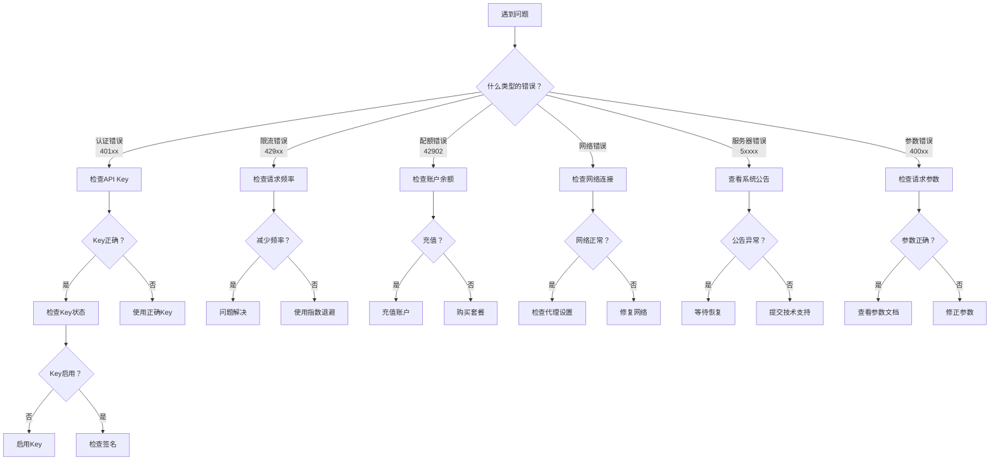

# 通用API服务平台 - 故障排查手册（增强版）

## 文档信息：

| 属性 | 内容 |
|------|------|
| **文档编号** | TROUBLESHOOT-PLATFORM-2026-001 |
| **版本** | V1.2 |
| **日期** | 2026-04-18 |
| **更新说明** | 增加前端日志诊断说明，补充管理API端点 |

---

## 1. 快速诊断流程

### 1.1 问题分类决策树



### 1.2 快速诊断命令

```bash
# 1. 测试API连通性
curl -I https://api.platform.com/v1/health

# 2. 测试认证
curl -X GET https://api.platform.com/v1/quota \
  -H "X-Access-Key: sk_test_xxxxxxxxxxxx" \
  -H "X-Signature: your_signature" \
  -H "X-Timestamp: $(date +%s000)" \
  -H "X-Nonce: $(uuidgen)"

# 3. 查看账户状态
curl -X GET https://api.platform.com/v1/account \
  -H "Authorization: Bearer your_token"
```

---

## 1.5 Web控制台登录问题

### 常见登录失败原因

| 症状 | 可能原因 | 解决方案 |
|------|----------|----------|
| 登录无反应 | 后端服务未启动 | 检查后端是否运行在 8080 端口 |
| 401 错误 | 用户名/密码错误 | 使用正确的测试账号 |
| 页面不跳转 | 前端 API 配置错误 | 检查 `VITE_API_URL` 环境变量 |
| 登录成功但无 Token | 后端响应格式异常 | 查看浏览器控制台错误 |

### 测试账号登录

```
管理员: admin@example.com / admin123
所有者: owner@example.com / owner123
开发者: developer@example.com / dev123456
测试员: test@example.com / test123
```

### 诊断命令

```bash
# 测试后端API
curl -X POST http://localhost:8080/api/v1/auth/login \
  -H "Content-Type: application/json" \
  -d '{"email":"admin@example.com","password":"admin123"}'

# 期望响应
# {"code":0,"message":"success","data":{"access_token":"..."}}
```

### 密码哈希兼容性

系统支持 bcrypt 和 SHA256 两种密码格式，可通过环境变量配置：

```env
PASSWORD_HASH_MODE=auto  # 推荐，支持两种格式
PASSWORD_HASH_MODE=bcrypt  # 仅 bcrypt
PASSWORD_HASH_MODE=sha256  # 仅 SHA256
```

### 使用前端日志诊断问题

管理员可使用前端日志系统排查问题：

1. **访问日志页面**：管理员登录后访问 `/admin/devtools`
2. **查看日志级别**：
   - DEBUG（蓝色）：详细调试信息
   - INFO（绿色）：一般信息
   - WARN（橙色）：警告信息
   - ERROR（红色）：错误信息
3. **导出日志**：如需技术支持，可导出日志文件

常见日志关键词：
- `auth` - 认证相关
- `login` - 登录相关
- `token` - Token 相关
- `401` - 认证错误
- `error` - 错误信息

---

## 2. 完整错误码详解

### 2.1 认证相关错误（401xx）

| 错误码 | 名称 | HTTP状态 | 详细说明 | 常见原因 | 解决方案 |
|--------|------|----------|----------|----------|----------|
| 40101 | UNAUTHORIZED | 401 | 未认证 | 未传递API Key或认证信息 | 确保在请求头中正确传递 `X-Access-Key` |
| 40102 | INVALID_KEY | 401 | API Key无效 | Key格式错误或不存在 | 检查Key格式：`sk_live_` 或 `sk_test_` 开头 |
| 40103 | KEY_DISABLED | 401 | Key已禁用 | Key被管理员禁用 | 登录控制台，检查Key状态，点击启用 |
| 40104 | KEY_EXPIRED | 401 | Key已过期 | Key超过有效期 | 登录控制台，更新或重新生成Key |
| 40002 | INVALID_SIGNATURE | 400 | 签名无效 | HMAC签名计算错误 | 检查签名算法，参考SDK实现 |
| 40003 | TIMESTAMP_EXPIRED | 400 | 时间戳过期 | 请求时间与服务器时间差>5分钟 | 同步系统时间，使用NTP服务 |
| 40004 | NONCE_REUSED | 400 | Nonce重复 | 使用了相同的随机字符串 | 每次请求使用唯一的随机字符串 |

**认证错误排查流程**：

```python
# Python诊断代码
from api_platform import Client
import hashlib
import time
import uuid

def diagnose_auth_issue(api_key, api_secret):
    """诊断认证问题"""
    
    # 1. 检查Key格式
    print("=" * 50)
    print("步骤1: 检查Key格式")
    print("=" * 50)
    
    if not api_key.startswith(("sk_live_", "sk_test_")):
        print(f"❌ Key格式错误：{api_key}")
        print("   正确格式：sk_live_xxx 或 sk_test_xxx")
        return
    
    print(f"✅ Key格式正确：{api_key[:10]}...")
    
    # 2. 检查SDK初始化
    print("\n" + "=" * 50)
    print("步骤2: 检查SDK初始化")
    print("=" * 50)
    
    try:
        client = Client(api_key=api_key, api_secret=api_secret)
        print("✅ SDK初始化成功")
    except Exception as e:
        print(f"❌ SDK初始化失败：{e}")
        return
    
    # 3. 检查配额接口（轻量级测试）
    print("\n" + "=" * 50)
    print("步骤3: 测试配额查询")
    print("=" * 50)
    
    try:
        quota = client.get_quota()
        print("✅ 认证成功！")
        print(f"   RPM限制：{quota.rpm.limit}")
        print(f"   余额：{quota.balance.amount}")
    except Exception as e:
        print(f"❌ 认证失败：{e}")
        print(f"   错误类型：{type(e).__name__}")
        print(f"   错误码：{getattr(e, 'code', 'N/A')}")

# 使用
diagnose_auth_issue(
    api_key="sk_live_xxxxxxxxxxxx",
    api_secret="your_secret"
)
```

### 2.2 限流相关错误（429xx）

| 错误码 | 名称 | 说明 | 限制类型 | 解决方案 |
|--------|------|------|----------|----------|
| 42901 | RATE_LIMIT_EXCEEDED | 请求过于频繁 | RPM（每分钟）/ RPH（每小时） | 降低请求频率，使用指数退避 |
| 42902 | QUOTA_EXCEEDED | 配额超限 | 日配额 / 月配额 / 账户余额 | 充值或购买套餐 |
| 42903 | CONCURRENT_LIMIT | 并发超限 | 同时进行的请求数 | 减少并发请求 |

**限流问题解决方案**：

```python
# 方案1：SDK内置重试（推荐）
client = Client(
    api_key="xxx",
    max_retries=5,        # 最多重试5次
    retry_delay=1,         # 初始延迟1秒
    retry_multiplier=2     # 指数退避倍数
)

# 方案2：手动限流控制
import time
from collections import deque

class RequestRateLimiter:
    """请求限流器"""
    
    def __init__(self, rpm_limit=100):
        self.rpm_limit = rpm_limit
        self.requests = deque()
        self.lock = time.lock()
    
    def acquire(self):
        """获取请求许可"""
        with self.lock:
            now = time.time()
            
            # 清理超过1分钟的请求记录
            while self.requests and self.requests[0] < now - 60:
                self.requests.popleft()
            
            # 检查是否超限
            if len(self.requests) >= self.rpm_limit:
                # 计算需要等待的时间
                wait_time = self.requests[0] + 60 - now
                if wait_time > 0:
                    print(f"限流：等待{wait_time:.1f}秒")
                    time.sleep(wait_time)
                    # 清理过期记录
                    while self.requests and self.requests[0] < time.time() - 60:
                        self.requests.popleft()
            
            # 记录本次请求
            self.requests.append(time.time())

# 使用
limiter = RequestRateLimiter(rpm_limit=100)

for question in questions:
    limiter.acquire()
    response = client.psychology.chat(message=question)

# 方案3：令牌桶算法（更平滑）
import threading

class TokenBucket:
    """令牌桶算法实现"""
    
    def __init__(self, rate, capacity):
        self.rate = rate           # 每秒补充的令牌数
        self.capacity = capacity    # 桶容量
        self.tokens = capacity
        self.last_update = time.time()
        self.lock = threading.Lock()
    
    def acquire(self, tokens=1):
        """获取指定数量的令牌"""
        with self.lock:
            self._refill()
            
            if self.tokens >= tokens:
                self.tokens -= tokens
                return True
            else:
                return False
    
    def _refill(self):
        """补充令牌"""
        now = time.time()
        elapsed = now - self.last_update
        self.tokens = min(
            self.capacity,
            self.tokens + elapsed * self.rate
        )
        self.last_update = now
    
    def wait_for_token(self, tokens=1):
        """等待获取令牌"""
        while not self.acquire(tokens):
            time.sleep(0.1)

# 使用
bucket = TokenBucket(rate=1.5, capacity=100)  # 约90RPM

for question in questions:
    bucket.wait_for_token()
    response = client.psychology.chat(message=question)
```

### 2.3 业务相关错误（4xxxx）

| 错误码 | 名称 | HTTP状态 | 说明 | 解决方案 |
|--------|------|----------|------|----------|
| 40001 | BAD_REQUEST | 400 | 请求参数错误 | 检查请求体格式和必填参数 |
| 40005 | INVALID_PARAMETER | 400 | 参数值无效 | 检查参数类型、范围、格式 |
| 40006 | MISSING_PARAMETER | 400 | 缺少必填参数 | 添加缺失的参数 |
| 40301 | ACCESS_DENIED | 403 | 无权访问资源 | 确认账户权限 |
| 40302 | REPO_NOT_ALLOWED | 403 | 未开通仓库权限 | 在控制台开通仓库访问权限 |
| 40401 | REPO_NOT_FOUND | 404 | 仓库不存在 | 检查仓库名称 |
| 40402 | ENDPOINT_NOT_FOUND | 404 | 接口不存在 | 检查接口路径 |

**参数错误排查**：

```python
# 常见参数错误及解决方案

# 错误1：message参数为空
try:
    response = client.psychology.chat(message="")  # ❌ 空字符串
except ValidationError as e:
    print(f"错误：{e.message}")  # "message不能为空"

# 正确做法
if message and message.strip():
    response = client.psychology.chat(message=message.strip())
else:
    raise ValueError("问题内容不能为空")

# 错误2：参数类型错误
try:
    response = client.psychology.chat(
        message="test",
        context="age: 30"  # ❌ 应该传字典
    )
except ValidationError as e:
    print(f"错误：{e.message}")

# 正确做法
response = client.psychology.chat(
    message="test",
    context={"age": 30}  # ✅ 传字典
)

# 错误3：参数值超出范围
try:
    response = client.translation.translate(
        text="hello",
        source_lang="invalid_lang",  # ❌ 不支持的语言
        target_lang="zh"
    )
except ValidationError as e:
    print(f"错误：{e.message}")

# 正确做法
SUPPORTED_LANGS = ["zh", "en", "ja", "ko", "fr", "de"]
if source_lang not in SUPPORTED_LANGS:
    raise ValueError(f"不支持的源语言：{source_lang}")
```

### 2.4 服务相关错误（5xxxx）

| 错误码 | 名称 | HTTP状态 | 说明 | 解决方案 |
|--------|------|----------|------|----------|
| 50001 | INTERNAL_ERROR | 500 | 服务器内部错误 | 稍后重试，记录错误 |
| 50002 | SERVICE_UNAVAILABLE | 503 | 服务不可用 | 查看系统公告 |
| 50301 | REPO_UNAVAILABLE | 503 | 仓库服务不可用 | 检查仓库状态，等待恢复 |
| 50302 | REPO_TIMEOUT | 503 | 仓库响应超时 | 增加超时时间或稍后重试 |
| 50303 | REPO_ERROR | 503 | 仓库返回错误 | 查看仓库文档，联系仓库所有者 |

---

## 3. 常见问题场景及解决方案

### 3.1 场景1：新用户集成失败

**症状**：刚注册的新用户，API调用失败。

**排查步骤**：

```python
# Step 1: 检查账户状态
account = client.get_account()
print(f"账户状态：{account.status}")
print(f"账户余额：{account.balance}")

# Step 2: 检查是否有免费额度
if hasattr(account, 'free_trial'):
    print(f"免费额度：{account.free_trial}")
    print(f"已使用：{account.free_trial_used}")

# Step 3: 检查Key权限
keys = client.list_keys()
for key in keys:
    print(f"Key名称：{key.name}")
    print(f"Key状态：{key.status}")
    print(f"可访问仓库：{key.allowed_repos}")

# Step 4: 检查仓库是否开通
repos = client.list_repositories()
for repo in repos:
    print(f"仓库：{repo.name}")
    print(f"状态：{repo.status}")
    print(f"已订阅：{repo.subscribed}")
```

**常见原因**：
1. 账户未激活（需要邮箱验证）
2. 余额为0且无免费额度
3. Key未开通对应仓库的访问权限

### 3.2 场景2：生产环境突然报错

**症状**：开发测试正常，生产环境突然报错。

**排查步骤**：

```python
import traceback

# Step 1: 获取详细错误信息
try:
    response = client.psychology.chat(message="test")
except Exception as e:
    print(f"错误类型：{type(e).__name__}")
    print(f"错误码：{getattr(e, 'code', 'N/A')}")
    print(f"错误消息：{e.message}")
    print(f"请求ID：{getattr(e, 'request_id', 'N/A')}")
    print(f"详细信息：{getattr(e, 'details', {})}")

# Step 2: 检查是否是Key问题
# 生产Key vs 测试Key
print(f"当前Key：{client.api_key[:10]}...")
if client.api_key.startswith("sk_test_"):
    print("⚠️ 警告：使用测试Key，无法访问生产数据")

# Step 3: 检查环境差异
import os
print(f"API URL：{os.environ.get('API_BASE_URL', 'default')}")

# Step 4: 查看日志
# 检查请求日志
print("\n请求日志：")
# SDK内部日志已记录
```

**常见原因**：
1. 使用了测试Key（sk_test_）而非生产Key（sk_live_）
2. 生产环境API URL配置错误
3. 生产环境网络受限

### 3.3 场景3：高并发时全部失败

**症状**：单次调用正常，高并发时全部失败。

**解决方案**：

```python
# 方案1：降低并发度
MAX_CONCURRENT = 10  # 限制并发数

with ThreadPoolExecutor(max_workers=MAX_CONCURRENT) as executor:
    futures = [
        executor.submit(client.psychology.chat, q)
        for q in questions
    ]
    results = [f.result() for f in futures]

# 方案2：添加请求间隔
for question in questions:
    response = client.psychology.chat(message=question)
    time.sleep(0.1)  # 每次请求间隔100ms

# 方案3：使用异步批量接口
response = client.batch({
    "calls": [
        {"repo": "psychology", "method": "chat", "params": {"message": q}}
        for q in questions
    ]
})
```

### 3.4 场景4：WebSocket连接断开

**症状**：使用WebSocket时连接频繁断开。

**排查步骤**：

```python
# 检查WebSocket状态
import websocket
import time

class WebSocketClient:
    def __init__(self, api_key):
        self.api_key = api_key
        self.ws = None
        self.reconnect_attempts = 0
        self.max_reconnect = 5
    
    def connect(self, url):
        try:
            self.ws = websocket.WebSocketApp(
                url,
                header={
                    "X-Access-Key": self.api_key
                },
                on_open=self.on_open,
                on_message=self.on_message,
                on_error=self.on_error,
                on_close=self.on_close
            )
            self.ws.run_forever(ping_interval=30)  # 30秒心跳
            
        except Exception as e:
            print(f"连接错误：{e}")
            self._reconnect()
    
    def _reconnect(self):
        """自动重连"""
        if self.reconnect_attempts < self.max_reconnect:
            self.reconnect_attempts += 1
            wait_time = min(60, 2 ** self.reconnect_attempts)
            print(f"等待{wait_time}秒后重连（第{self.reconnect_attempts}次）")
            time.sleep(wait_time)
            self.connect(self.url)
        else:
            print("重连次数耗尽，请检查网络或服务状态")
```

---

## 4. 日志分析指南

### 4.1 SDK日志配置

```python
import logging

# 配置日志
logging.basicConfig(
    level=logging.DEBUG,
    format='%(asctime)s - %(name)s - %(levelname)s - %(message)s'
)

# 创建SDK客户端
client = Client(
    api_key="xxx",
    log_level="DEBUG"  # DEBUG/INFO/WARNING/ERROR
)

# 日志示例
# 2026-04-17 10:00:00 - api_platform - DEBUG - Request: POST /v1/repositories/psychology/chat
# 2026-04-17 10:00:00 - api_platform - DEBUG - Headers: {'X-Access-Key': 'sk_live_xxx', ...}
# 2026-04-17 10:00:00 - api_platform - DEBUG - Body: {'message': 'test'}
# 2026-04-17 10:00:00 - api_platform - DEBUG - Response: 200 {'code': 0, 'data': {...}}
```

### 4.2 日志分析技巧

```python
# 分析限流规律
import re
from collections import Counter

def analyze_rate_limits():
    """分析限流发生的时间规律"""
    
    logs = """
    2026-04-17 10:00:00 - Response: 429 {"code": 42901}
    2026-04-17 10:00:01 - Response: 429 {"code": 42901}
    2026-04-17 10:00:02 - Response: 429 {"code": 42901}
    2026-04-17 10:01:00 - Response: 200 {"code": 0}
    """
    
    # 统计限流发生次数
    rate_limits = re.findall(r'(\d{4}-\d{2}-\d{2} \d{2}:\d{2}):\d{2}.*429', logs)
    counter = Counter(rate_limits)
    
    print("限流发生频率：")
    for time_point, count in counter.most_common():
        print(f"  {time_point}: {count}次")
    
    # 分析请求间隔
    timestamps = re.findall(r'(\d{4}-\d{2}-\d{2} \d{2}:\d{2}:\d{2})', logs)
    intervals = []
    for i in range(1, len(timestamps)):
        # 计算时间差
        t1 = timestamps[i-1]
        t2 = timestamps[i]
        # 简化的间隔计算
        intervals.append(f"{t1} -> {t2}")
    
    print("\n请求间隔：")
    for interval in intervals:
        print(f"  {interval}")

# 分析响应时间
def analyze_response_times():
    """分析API响应时间"""
    
    responses = [
        {"latency_ms": 150, "status": 200},
        {"latency_ms": 180, "status": 200},
        {"latency_ms": 200, "status": 200},
        {"latency_ms": 30000, "status": 503},  # 超时
        {"latency_ms": 160, "status": 200},
    ]
    
    latencies = [r["latency_ms"] for r in responses if r["status"] == 200]
    timeouts = [r for r in responses if r["status"] in [503, 504]]
    
    print(f"平均响应时间：{sum(latencies)/len(latencies):.2f}ms")
    print(f"超时次数：{len(timeouts)}")
    
    if timeouts:
        print("\n超时详情：")
        for t in timeouts:
            print(f"  延迟：{t['latency_ms']}ms，状态：{t['status']}")
```

### 4.3 请求ID追踪

```python
# 每次请求的request_id用于追踪
response = client.psychology.chat(message="test")
print(f"请求ID：{response.request_id}")  # req_abc123def456

# 错误时也包含request_id
try:
    response = client.psychology.chat(message="test")
except Exception as e:
    print(f"错误请求ID：{e.request_id}")  # req_xyz789

# 提交技术支持时提供request_id
support_ticket = {
    "request_id": "req_abc123def456",
    "error_code": "42901",
    "error_message": "Rate limit exceeded",
    "repo": "psychology",
    "endpoint": "/chat",
    "timestamp": "2026-04-17T10:00:00Z"
}
```

---

## 5. 监控告警配置

### 5.1 配额告警

```python
# 设置配额告警回调
client.set_quota_alert(
    type="daily",              # daily/monthly
    threshold=0.8,             # 80%时触发
    callback="https://your-server.com/webhook",
    notify_email=True          # 发送邮件通知
)

# Webhook接收告警
from flask import Flask, request

app = Flask(__name__)

@app.route('/webhook', methods=['POST'])
def quota_alert():
    data = request.json
    
    alert_type = data.get('type')
    usage = data.get('usage')
    threshold = data.get('threshold')
    
    print(f"配额告警！类型：{alert_type}，使用率：{usage/threshold*100:.1f}%")
    
    # 发送告警通知
    send_alert(
        title="API配额告警",
        message=f"使用量已达{threshold*100}%，当前使用{usage}"
    )
    
    return {"status": "ok"}
```

### 5.2 错误率监控

```python
import time
from collections import deque

class ErrorRateMonitor:
    """错误率监控"""
    
    def __init__(self, window_size=100):
        self.window_size = window_size
        self.requests = deque()
        self.errors = deque()
    
    def record_request(self, success, error_code=None):
        now = time.time()
        self.requests.append((now, success, error_code))
        
        if not success:
            self.errors.append((now, error_code))
        
        # 清理过期记录
        self._cleanup(now)
    
    def _cleanup(self, now):
        cutoff = now - 3600  # 保留1小时数据
        while self.requests and self.requests[0][0] < cutoff:
            self.requests.popleft()
        while self.errors and self.errors[0][0] < cutoff:
            self.errors.popleft()
    
    def get_error_rate(self):
        """获取错误率"""
        if not self.requests:
            return 0.0
        
        recent = [r for r in self.requests if time.time() - r[0] < 300]  # 5分钟内
        if not recent:
            return 0.0
        
        errors = sum(1 for r in recent if not r[1])
        return errors / len(recent)
    
    def get_error_distribution(self):
        """获取错误分布"""
        recent_errors = [e for e in self.errors if time.time() - e[0] < 3600]
        from collections import Counter
        return Counter(e[1] for e in recent_errors)

# 使用
monitor = ErrorRateMonitor()

try:
    response = client.psychology.chat(message="test")
    monitor.record_request(success=True)
except Exception as e:
    monitor.record_request(success=False, error_code=getattr(e, 'code', 'UNKNOWN'))

# 检查错误率
error_rate = monitor.get_error_rate()
if error_rate > 0.1:  # 超过10%
    send_alert(f"API错误率过高：{error_rate*100:.1f}%")
```

---

## 6. 获取技术支持

### 6.1 提交工单前准备

```python
# 生成诊断报告
def generate_diagnostic_report(client):
    """生成诊断报告用于技术支持"""
    
    report = []
    report.append("=" * 60)
    report.append("技术支持诊断报告")
    report.append("=" * 60)
    report.append(f"生成时间：{time.strftime('%Y-%m-%d %H:%M:%S')}")
    report.append("")
    
    # 1. 环境信息
    report.append("【环境信息】")
    report.append(f"SDK版本：{client.version}")
    report.append(f"Python版本：{platform.python_version()}")
    report.append(f"操作系统：{platform.platform()}")
    report.append("")
    
    # 2. 账户信息
    report.append("【账户信息】")
    try:
        account = client.get_account()
        report.append(f"账户ID：{account.id}")
        report.append(f"账户余额：{account.balance}")
    except Exception as e:
        report.append(f"无法获取账户信息：{e}")
    report.append("")
    
    # 3. API Key信息
    report.append("【API Key信息】")
    report.append(f"Key前缀：{client.api_key[:15]}...")
    report.append("")
    
    # 4. 配额信息
    report.append("【配额信息】")
    try:
        quota = client.get_quota()
        report.append(f"RPM限制：{quota.rpm.limit}")
        report.append(f"RPM已用：{quota.rpm.used}")
        report.append(f"日配额限制：{quota.daily.limit}")
        report.append(f"日配额已用：{quota.daily.used}")
    except Exception as e:
        report.append(f"无法获取配额信息：{e}")
    report.append("")
    
    # 5. 最近错误
    report.append("【最近错误】")
    try:
        logs = client.get_logs(limit=10)
        errors = [log for log in logs.items if log.status_code >= 400]
        for err in errors[:5]:
            report.append(f"时间：{err.created_at}")
            report.append(f"请求ID：{err.request_id}")
            report.append(f"状态码：{err.status_code}")
            report.append("")
    except Exception as e:
        report.append(f"无法获取错误日志：{e}")
    
    report.append("=" * 60)
    
    return "\n".join(report)

# 生成并保存报告
report = generate_diagnostic_report(client)
print(report)

# 保存到文件
with open("diagnostic_report.txt", "w") as f:
    f.write(report)
```

### 6.2 联系支持的方式

| 渠道 | 说明 | 响应时间 |
|------|------|----------|
| 工单系统 | 控制台提交工单 | 24小时内 |
| 技术支持邮箱 | support@platform.com | 24小时内 |
| 紧急电话 | +86-xxx-xxxx | 1小时内 |
| 技术交流群 | 见内部群列表 | 即时 |

---

## 7. 预防措施清单

### 7.1 开发阶段

- [ ] 使用测试Key进行开发测试
- [ ] 实现完整的错误处理
- [ ] 配置日志记录
- [ ] 测试限流场景
- [ ] 验证配额扣费

### 7.2 上线前检查

- [ ] 切换到生产Key
- [ ] 配置监控告警
- [ ] 设置配额告警阈值
- [ ] 测试重试机制
- [ ] 验证熔断降级

### 7.3 生产环境

- [ ] 定期检查配额余额
- [ ] 监控错误率
- [ ] 关注系统公告
- [ ] 保持SDK更新

---

## 8. 更新日志

| 版本 | 日期 | 更新内容 |
|------|------|----------|
| v1.2.0 | 2026-04-18 | 增加前端日志诊断说明，补充管理API端点 |
| v1.1.0 | 2026-04-17 | 完善错误码详解，增加限流解决方案 |
| v1.0.0 | 2026-04-16 | 初始版本 |
